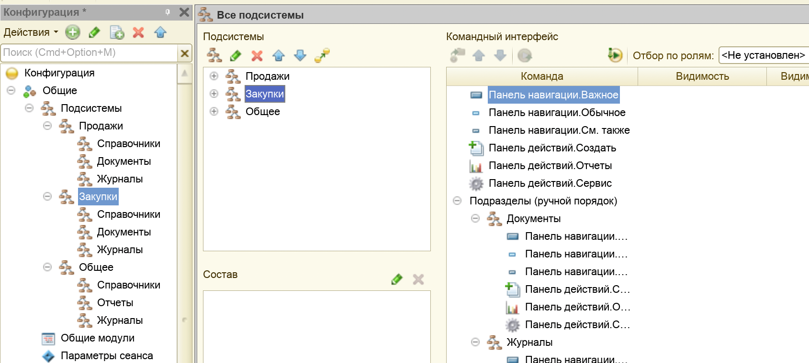
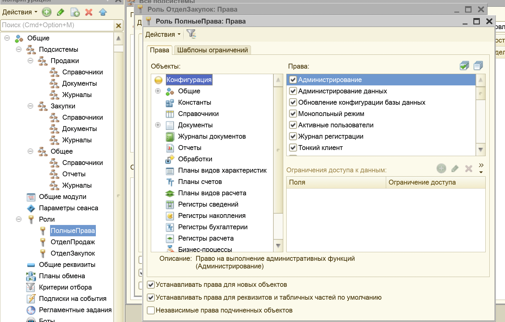
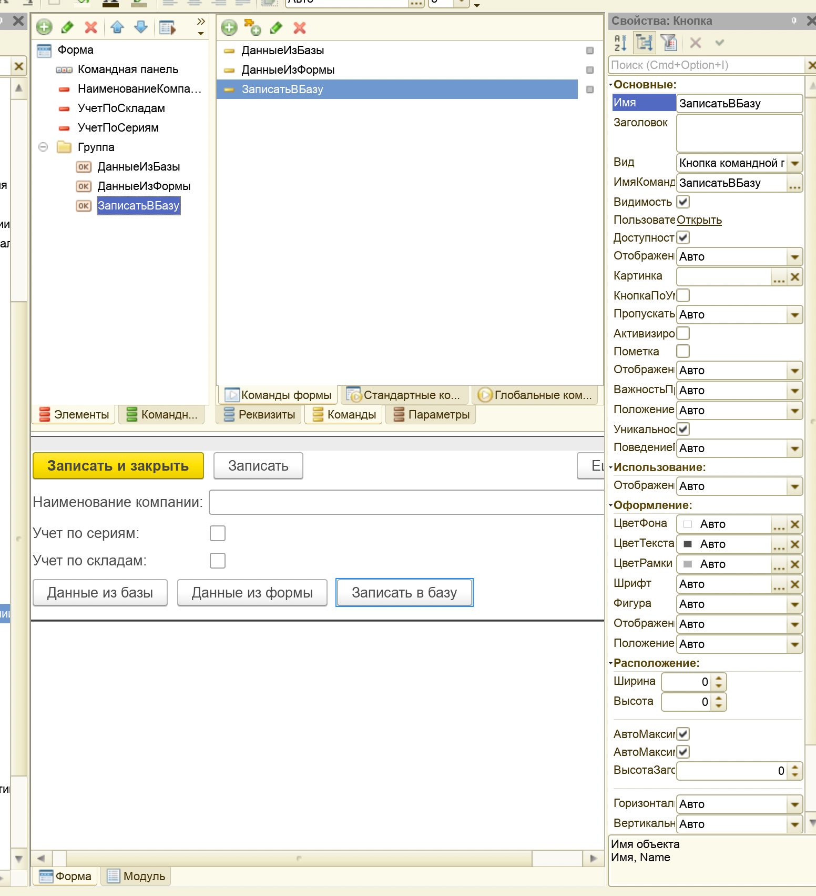
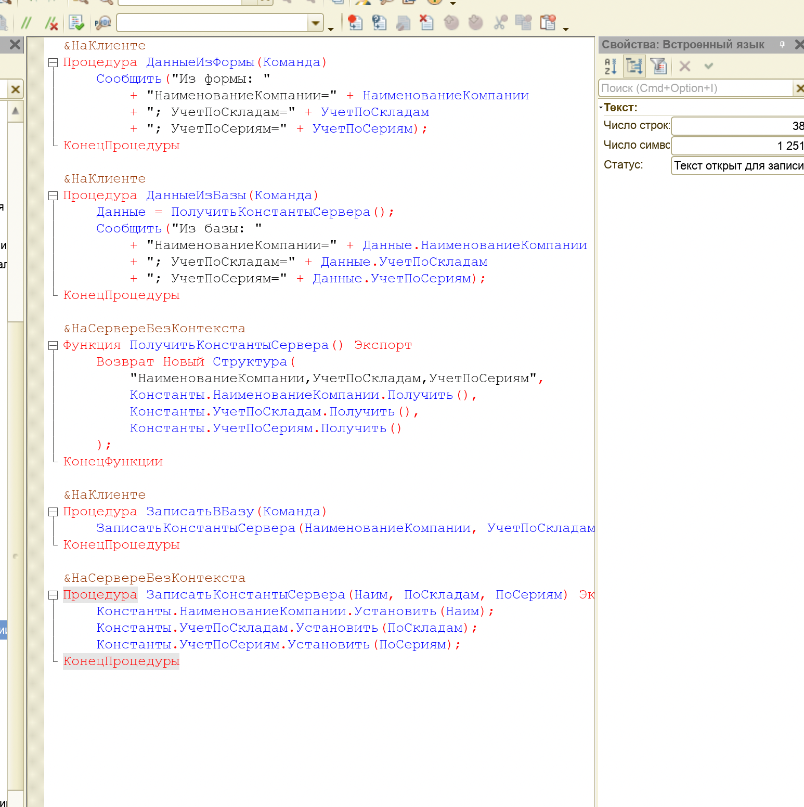
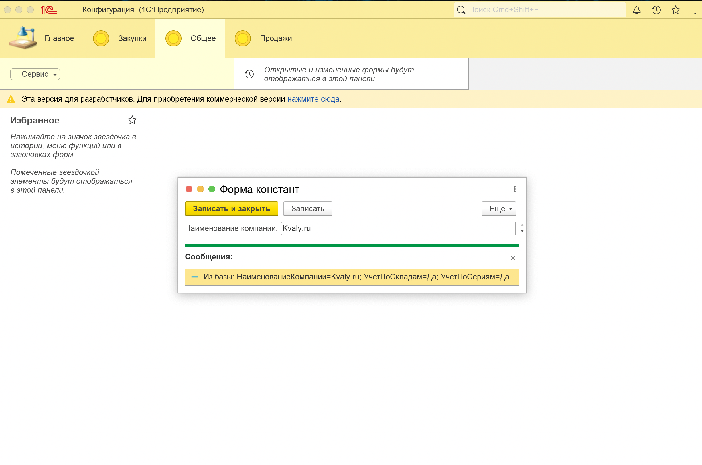

# Лабораторная работа №1 — Общие сведения. Интерфейс. Подсистемы. Базовые формы

## Цель

Цель работы – ознакомиться с основными принципами работы в платформе «1С:Предприятие 8.2», получить практические навыки
работы по созданию подсистем, справочников и команд.

## Среда выполнения

- **ОС**: macOS
- **Платформа 1С**: (8.3.27)
- **Тип ИБ**: файловая

## Порядок выполнения (чеклист)

1.  [x] *Определить в своей конфигурации иерархию подсистем, как на рисунке ниже.*

 2.  [x] *Поправить последовательность разделов через «Открыть командный интерфейс конфигурации» и перемещение подсистем
    в
    нужном порядке.*

3.  [x] *Определить состав ролей: `ПолныеПрава`, `ОтделПродаж`, `ОтделЗакупок`; настроить права (полные — всё;
    остальные —
    по логике).*

4.  [x] *Создать константы: `НаименованиеКомпании` (Строка 100), `УчетПоСкладам` (Булево), `УчетПоСериям` (Булево).*

5.  [x] *Создать общую форму констант (как в методичке).*

6.  [x] *На вкладке «Команды» формы создать новую команду.*

7.  [x] *Переименовать команду в `ДанныеИзФормы`, назначить обработчик.*

8.  [x] *Вставить в обработчик `ДанныеИзФормы` код из методички.*

9.  [x] *Аналогично создать команду `ДанныеИзБазы` и вставить код из методички.*

10. [x] *Добавить на форму командную панель (Группа → Группа-Командная панель) и поместить команды; привести интерфейс к
    виду из методички.*

11. [x] *Выполнить компиляцию/обновление конфигурации БД.*

12. [x] *Запустить ***«1С:Предприятие»***, проверить работу формы/команд.*

13. [x] *Выгрузить информационную базу (`.dt`).*

14. [x] *Продемонстрировать результаты (если требуется преподавателем).*

## Артефакты

- [x] **Дерево подсистем + порядок разделов**:  
  

- [x] **Роли и права**:
  

- [x] **Константы**:
  

- [x] **Общая форма + команды**:
  

- [x] **Проверка в режиме ***«1С:Предприятие»*****:
  

## Результат

- В ходе лабораторной работы была создана структура подсистем и настроен командный интерфейс (порядок разделов).
- Созданы роли `ПолныеПрава`, `ОтделПродаж`, `ОтделЗакупок` и назначены права доступа.
- Добавлены константы `НаименованиеКомпании`, `УчетПоСкладам`, `УчетПоСериям` и реализована общая форма для их
  просмотра/редактирования.
- На форме добавлены команды, которые выводят значения из текущих данных формы и из базы данных, работоспособность
  проверена в режиме «1С:Предприятие».
- Информационная база выгружена в файл `dump.dt`.

## Контрольные вопросы

1. **Назовите на какие группы можно разделить объекты платформы «1С:Предприятие»?**

***Ответ:*** *Объекты платформы можно разделить на объекты конфигурации (что настраивает разработчик),
объекты базы данных (экземпляры, которые хранят/представляют данные), и системные объекты платформы (служебные: формы,
запросы, типы, сессия, сообщения и т.п.).*

2. **Какие объекты конфигурации относятся к прикладным объектам?**

***Ответ:*** *К прикладным объектам относятся объекты предметной области: Справочники, Документы, Перечисления, Планы
видов
характеристик, Регистры сведений, Регистры накопления, Отчёты, Обработки, Журналы документов, Константы (и другие
аналогичные прикладные объекты).*

3. **Что может относиться к подчиненным объектам конфигурации?**

***Ответ:*** *Подчинённые (встроенные в состав прикладных объектов) — это, например: реквизиты, табличные части, формы (
элемента/списка/документа), макеты, команды, модули (объекта/формы/менеджера) и т.д.*

4. **Каковы действия разработчика при добавления объекта в конфигурацию?**

***Ответ:*** *Создать объект в дереве конфигурации, настроить свойства (имя, типы, состав реквизитов/табличных частей),
при
необходимости создать формы/команды/модули, включить в подсистемы/интерфейс, затем обновить конфигурацию базы данных и
проверить работу в режиме «1С:Предприятие».*

5. **Для чего необходимо устанавливать роли и права?**

***Ответ:*** *Для разграничения доступа пользователей к данным и функциям системы: безопасность, соблюдение правил
работы,
разделение обязанностей (кто что видит/может создавать/изменять/удалять).*

6. **Для чего нужен обработчик событий?**

***Ответ:*** *Обработчик событий нужен, чтобы выполнять код в ответ на действия пользователя или события системы (
нажатие
кнопки, изменение поля, открытие формы и т.п.): проверка/валидация, перерасчёт, заполнение, чтение/запись данных, вывод
сообщений.*
