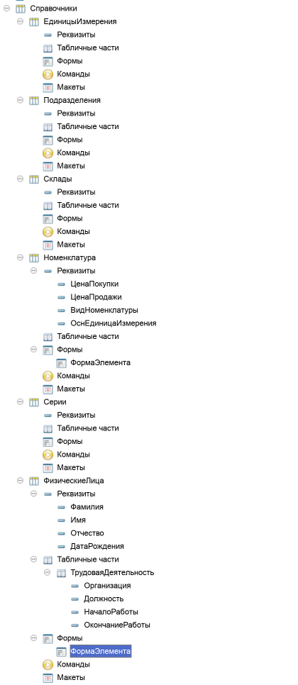
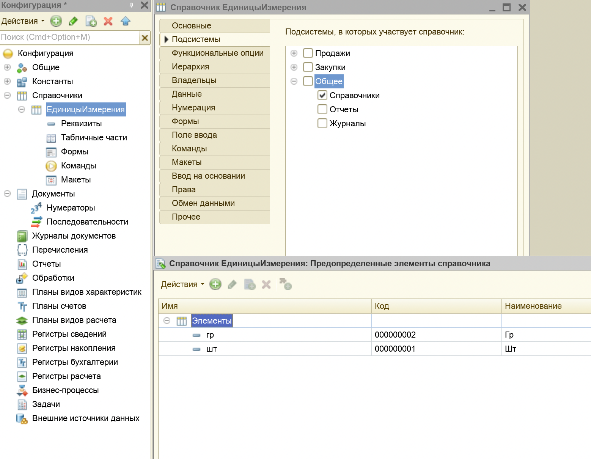
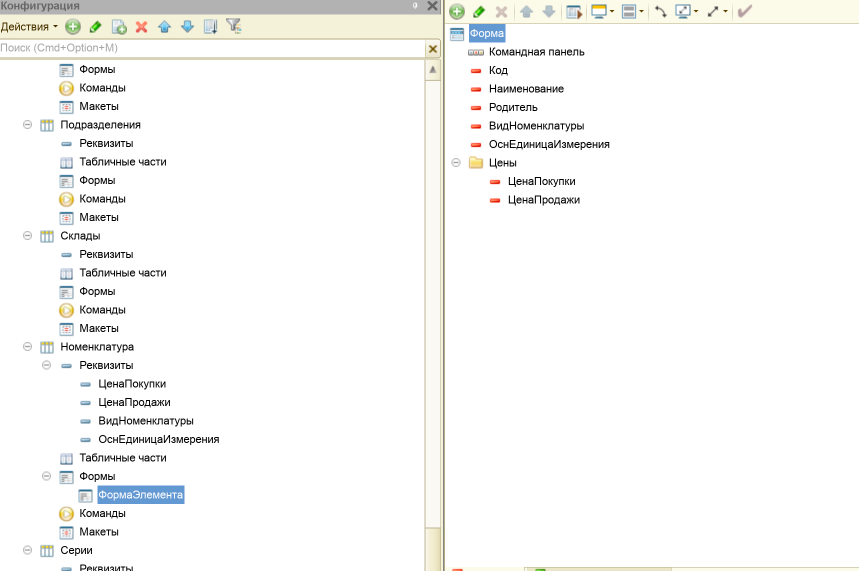
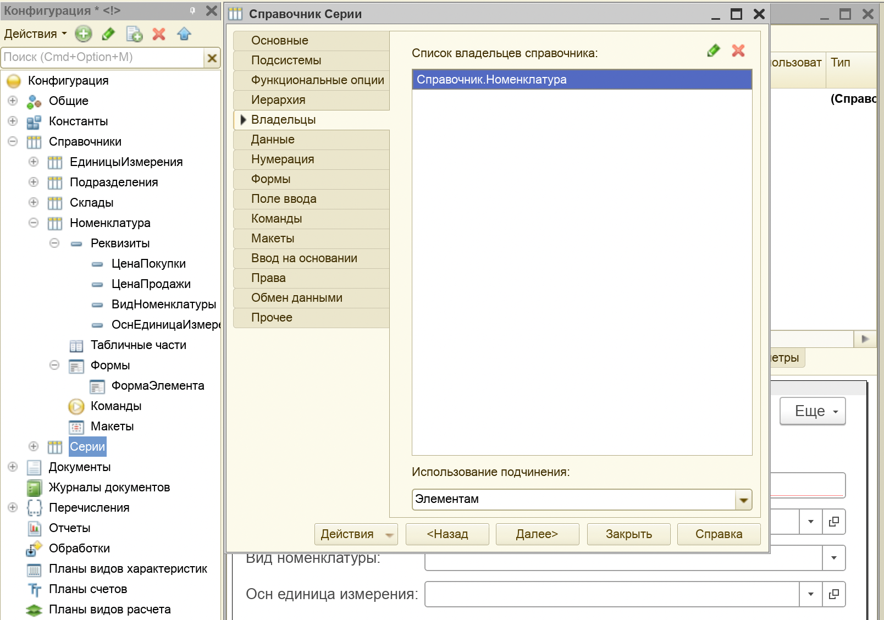
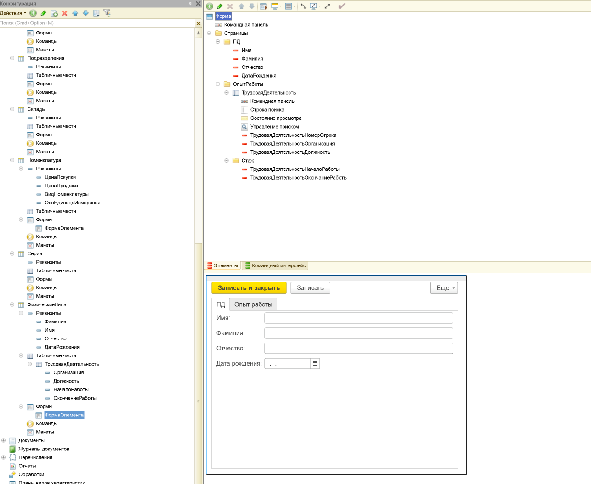
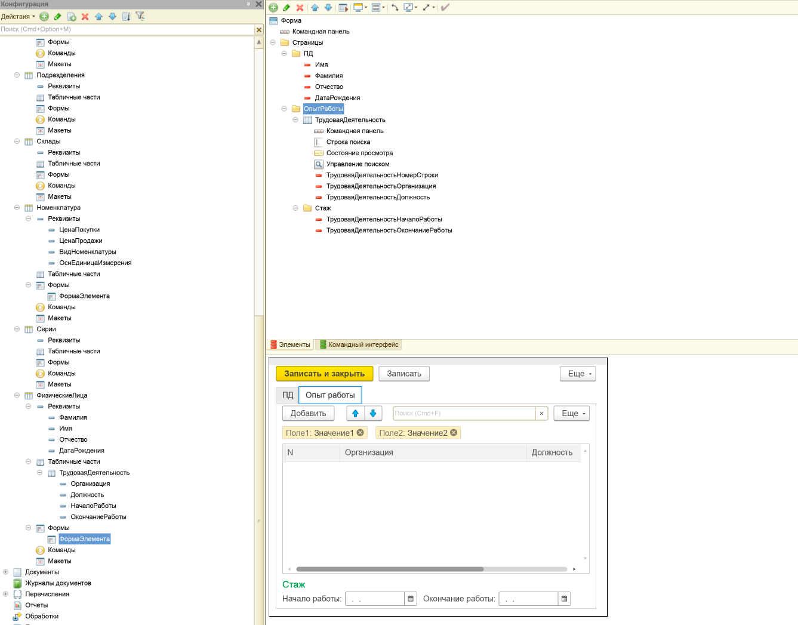
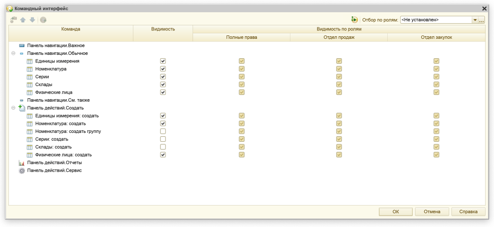
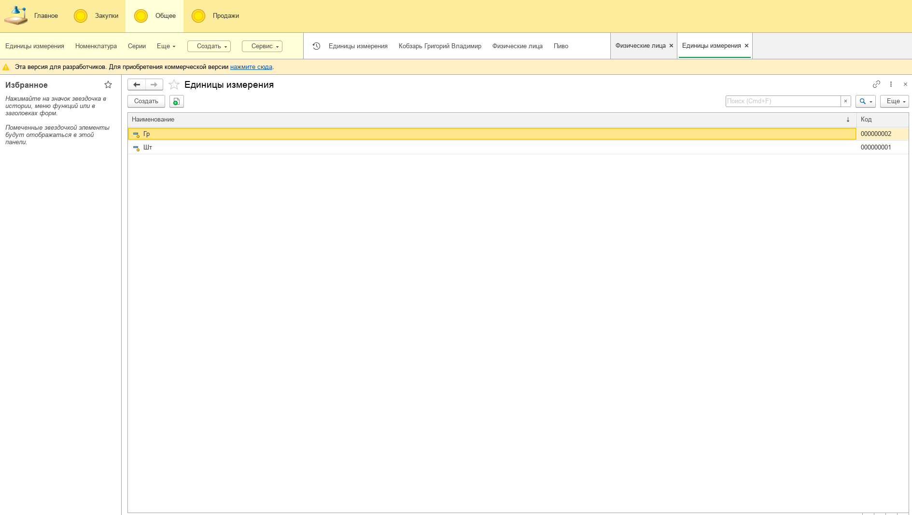
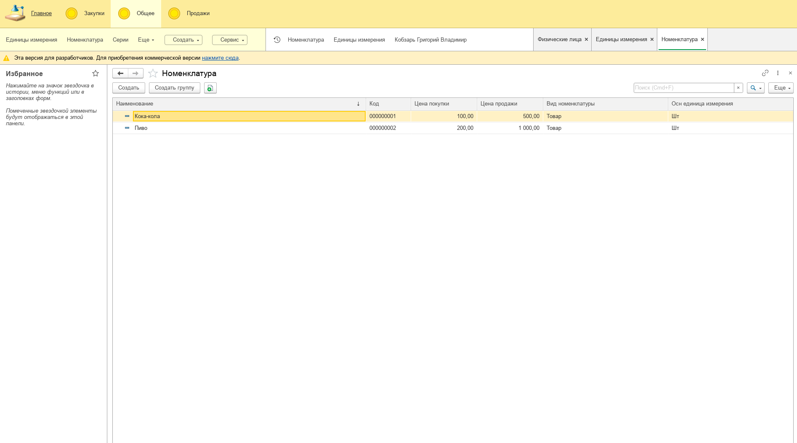
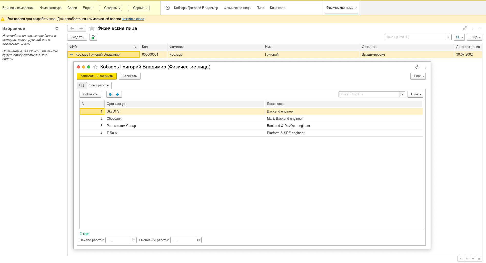

# Лабораторная работа №2 — Справочники. Иерархия справочников. Управление интерфейсом. Модуль формы

## Цель

Цель работы – изучить основные директивы компиляции «1С:Предприятие 8.2», получить практические навыки работы по
созданию справочников, перечислений, групп и печатных форм.

## Среда выполнения

- **ОС**: macOS
- **Платформа 1С**: (8.3.27)
- **Тип ИБ**: файловая

## Порядок выполнения (чеклист)

1.  [x] *Создать справочник `ЕдиницыИзмерения`.*

2.  [x] *Отнести к подсистеме `Общее → Справочники`.*

3.  [x] *Во вкладке «Прочее» добавить предопределенные элементы: `шт`, `гр`.*

4.  [x] *Создать иерархический справочник `Подразделения` (иерархия элементов) и отнести к `Общее → Справочники`.*

5.  [x] *Создать справочник `Склады` и отнести к `Общее → Справочники`.*

6.  [x] *Создать перечисление `ВидыТоваров`: `Товар`, `Услуга`.*

7.  [x] *Создать иерархический справочник `Номенклатура` (иерархия групп и элементов) и отнести
    к `Общее → Справочники`.*

8.  [x] *Добавить реквизиты справочника `Номенклатура`:*
    - *`ЦенаПокупки` (Число 15, точность 2, неотрицательное)*
    - *`ЦенаПродажи` (Число 15, точность 2, неотрицательное)*
    - *`ВидНоменклатуры` (ПеречислениеСсылка.`ВидыТоваров`)*
    - *`ОснЕдиницаИзмерения` (СправочникСсылка.`ЕдиницыИзмерения`)*

9.  [x] *Создать форму элемента для `Номенклатура`.*

10. [x] *Добавить группу «Цены» (обычная группа) и оформить (рамка группы, горизонтальная группировка),
    переместить `ЦенаПокупки/ЦенаПродажи`.*

11. [x] *Создать справочник `Серии`, владельцем указать `Номенклатура`, отнести к `Общее → Справочники`.*

12. [x] *Создать справочник `ФизическиеЛица` и добавить реквизиты: `Фамилия`, `Имя`, `Отчество`, `ДатаРождения`. Создать
    табличную часть `ТрудоваяДеятельность` с реквизитами: `Организация`, `Должность`, `НачалоРаботы`, `ОкончаниеРаботы`.
    У стандартного реквизита `Наименование` задать синоним `ФИО`.*

13. [x] *Создать форму элемента справочника `ФизическиеЛица`.*

14. [x] *На форме удалить элемент `Наименование`. Создать 2 страницы (Группа страниц → Группа-страница): на 2-ю страницу
    поместить табличную часть, на 1-ю — остальные элементы. Внутри табличной части создать обычную группу и поместить в
    неё `НачалоРаботы` и `ОкончаниеРаботы`.*

15. [x] *В модуле формы написать программный код (процедура, формирующая `ФИО`) и назначить её обработчиком
    события `ПриИзменении` для полей `Фамилия`, `Имя`, `Отчество`.*

16. [x] *Открыть командный интерфейс подсистемы `Общее → Справочники` и сделать видимыми команды создания элементов
    для: `ЕдиницыИзмерения`, `Номенклатура`, `ФизическиеЛица`.*

17. [x] *Выполнить компиляцию. Заполнить справочники данными.*

## Артефакты

- [x] **Справочники/перечисление в дереве**:  
  

- [x] **Предопределённые элементы `ЕдиницыИзмерения`**:  
  

- [x] **Реквизиты и форма `Номенклатура`**:  
  

- [x] **Владелец справочника `Серии`**:  
  

- [x] **`ФизическиеЛица`: реквизиты + табличная часть + синоним `ФИО`**:  
  

- [x] **Форма `ФизическиеЛица` (2 страницы)**:  
    
  

- [x] **Модуль формы (процедура формирования ФИО + обработчики ПриИзменении)**:  
  

- [x] **Командный интерфейс `Общее → Справочники` (видимые команды создания)**:  
  

- [x] **Формы в клиентском интерфейсе 1С:Предприятие**:
    
    
  

## Результат

В этой лабораторной работе я собрал базовые справочники для будущей конфигурации.

Я создал справочники:

- ЕдиницыИзмерения
- Подразделения (иерархия элементов)
- Склады
- Номенклатура (иерархия групп и элементов)
- Серии (владелец — Номенклатура).

Также я создал перечисление ВидыТоваров (Товар/Услуга) и добавил в Номенклатуру нужные реквизиты
(цены, вид номенклатуры, основная единица измерения), настроил форму элемента и визуально оформил цены отдельной
группой.

Далее я создал справочник ФизическиеЛица с реквизитами и табличной частью ТрудоваяДеятельность,
настроил форму элемента с двумя страницами (данные / трудовая деятельность), и сделал автоматическое
формирование ФИО (синоним стандартного “Наименование”) на основе
фамилии, имени и отчества через обработчики изменений/записи.

В командном интерфейсе подсистемы Общее → Справочники я включил видимость команд создания
элементов для нужных справочников.

После обновления конфигурации базы данных я заполнил справочники тестовыми
данными и проверил, что формы и ввод данных работают корректно.

## Контрольные вопросы

1. **Для чего предназначены справочники?**

***Ответ:*** *Справочники нужны для хранения списков однотипных объектов (например, склады, номенклатура, физические
лица).  
Я использую их как “базовые таблицы” системы: данные один раз завёл — и дальше на них ссылаются
документы/отчёты/регистры.*

2. **Что такое иерархия элементов справочника?**

***Ответ:*** *Это когда любой элемент справочника может быть “родителем” для другого элемента (то есть дерево строится
прямо из элементов). В таком варианте и элементы, и “папки” — по сути элементы одного типа.*

3. **Для чего предназначены перечисления и в чем отличие их от справочников?**

***Ответ:*** *Перечисления нужны для фиксированного набора значений, который пользователь не должен менять
(например: Товар/Услуга). Отличие от справочников в том, что справочник — это пополняемый пользователем список
(создаю/удаляю/редактирую элементы в режиме предприятия), а перечисление — набор значений,
который задаёт разработчик в конфигураторе.*

4. **Для чего нужна иерархия групп?**

***Ответ:*** *Чтобы разделять записи справочника на группы (папки) и элементы, и удобно организовывать большой
список по категориям. Например, в Номенклатуре это позволяет разложить товары по группам.*

5. **В каких случаях надо создавать табличные формы?**

***Ответ:*** *Когда у одного объекта может быть несколько однотипных строк данных. Например, у физлица может быть
несколько записей о трудовой деятельности — это как раз удобно хранить в табличной части.*

6. **Что из себя представляет печатная форма?**

***Ответ:*** *Печатная форма — это оформленный вывод данных (обычно через макет + табличный документ), который можно
распечатать или сохранить. По сути, это шаблон, куда подставляются данные объекта
(документа/справочника) и формируется итоговый “лист”.*

7. **Для чего нужны директивы компиляции?**

***Ответ:*** *Чтобы явно указать, где выполняется код: на клиенте или на сервере (&НаКлиенте, &НаСервере,
&НаСервереБезКонтекста и т.д.). Это важно, потому что не всё доступно в тонком клиенте напрямую, и часть логики/доступ
к данным нужно выполнять на сервере.*
