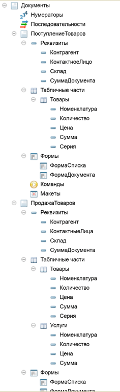
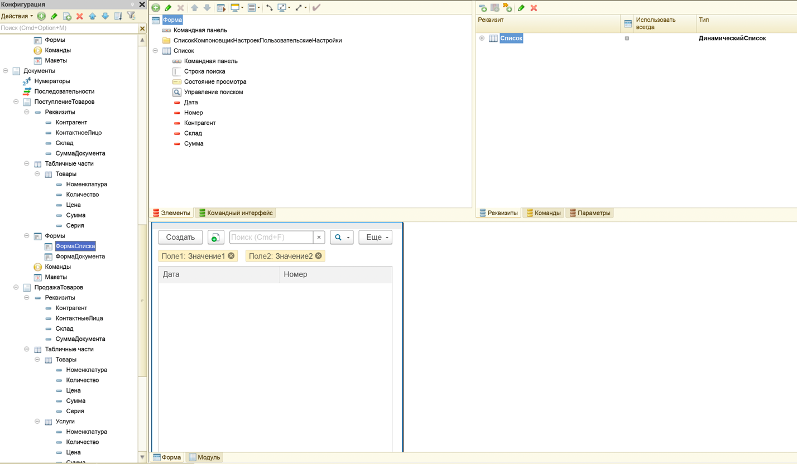
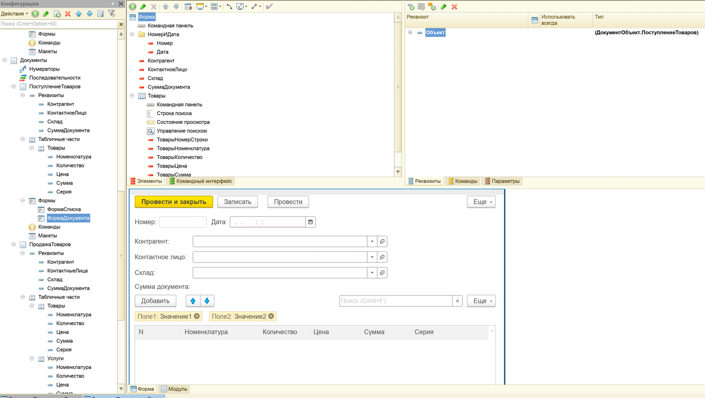
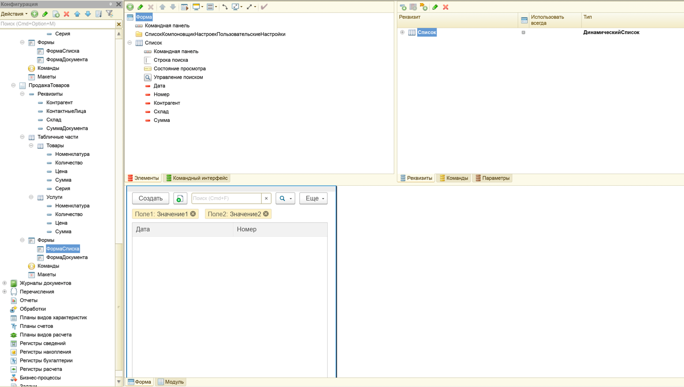
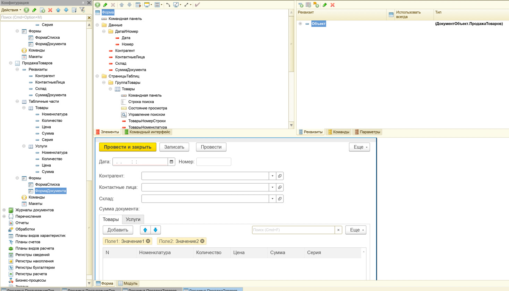
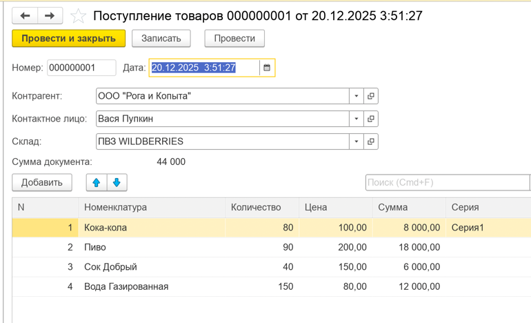
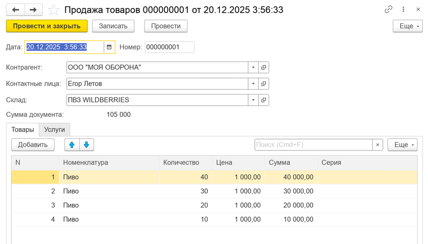
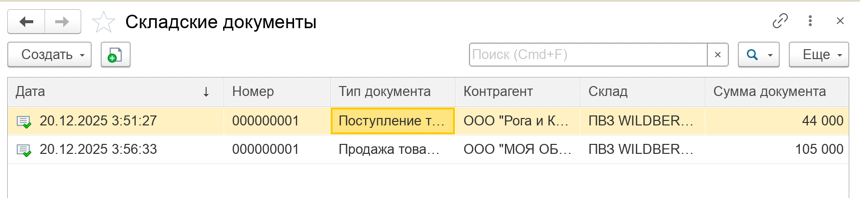

# Лабораторная работа №3 — Документы. Журналы документов

## Цель

Цель работы – изучить основную структуру и формы объектов «Документы» и «Журнал документов» «1С:Предприятие 8.2», получить практические навыки работы по созданию документов и журналов документов.

## Среда выполнения

- **ОС**: macOS
- **Платформа 1С**: (8.3.27)
- **Тип ИБ**: файловая

## Порядок выполнения (чеклист)

1.  [x] *Создать справочник `Контрагенты` (иерархический: группы+элементы) и подчинённый `КонтактныеЛица` (реквизит `Телефон`). Отнести к подсистемам закупок/продаж (как в методичке).*

2.  [x] *Создать документ `ПоступлениеТоваров` (подсистема `Закупки → Документы`) с реквизитами: `Контрагент`, `КонтактноеЛицо`, `Склад`, `СуммаДокумента` (15:0, неотриц.).*

3.  [x] *Создать табличную часть `Товары`: `Номенклатура`, `Количество` (10:0), `Цена` (10:2), `Сумма` (10:2), `Серия`.*

4.  [x] *Настроить связи параметров выбора для `КонтактноеЛицо` (вкладка «Представление») по рисунку в методичке.*

5.  [x] *Аналогично настроить связь для табличного реквизита `Серия`.*

6.  [x] *Создать форму списка документа (дата, номер, контрагент, склад, сумма).*

7.  [x] *Создать форму документа: дату/номер в горизонтальную группу с рамкой; для `СуммаДокумента`, `Цена`, `Сумма` поставить вид «Поле надписи».*

8.  [x] *В модуль формы документа вставить код из методички (пересчёт цены/суммы/итога; обработчики изменений; функции получения цены/контрагента).*

9.  [x] *Назначить обработчики событиям (ПриИзменении) там, где это необходимо.*

10. [x] *По аналогии создать документ `ПродажаТоваров`, отнести к `Продажи → Документы`.*

11. [x] *Для `ПродажаТоваров` создать реквизиты: `Контрагент`, `КонтактноеЛицо`, `Склад`, `СуммаДокумента` (15:0, неотриц.). Создать табличные части:*
    - *`Товары`: `Номенклатура`, `Количество` (10:0), `Цена` (10:2), `Сумма` (10:2), `Серия`*
    - *`Услуги`: `Номенклатура`, `Количество` (10:0), `Цена` (10:2), `Сумма` (10:2)*

12. [x] *Создать форму списка `ПродажаТоваров` (дата, номер, контрагент, склад, сумма).*

13. [x] *Создать форму документа `ПродажаТоваров` (как у `ПоступлениеТоваров`), но табличные части разместить на двух страницах. Для элементов `Цена`/`Сумма` обеих табличных частей и `СуммаДокумента` установить вид «Поле надписи».*

14. [x] *Для реквизита `Номенклатура` табличной части `Услуги` настроить параметры выбора (по рисунку в методичке).*

15. [x] *В модуль формы документа `ПродажаТоваров` вставить код из методички (пересчёт сумм/итога; получение цены продажи; связь контактного лица с контрагентом).*

16. [x] *Назначить обработчики событий (ПриИзменении) для полей `Количество`/`Номенклатура` (Товары/Услуги) и `КонтактноеЛицо`.*

17. [x] *Создать журнал документов `СкладскиеДокументы`, отнести к `Общее → Журналы`. Указать графы: `Контрагент`, `Склад`, `СуммаДокумента`. Регистрируемые документы: `ПоступлениеТоваров`, `ПродажаТоваров`.*

18. [x] *Обновить конфигурацию БД, выполнить компиляцию и заполнить систему данными (проверить пересчёт и связи выбора).*

## Артефакты

- [x] **Справочники `Контрагенты/КонтактныеЛица`**:  
  

- [x] **Реквизиты документов + табличная часть**:  
  

- [x] **Форма списка + форма документа `ПоступлениеТоваров`**:  
  
  

- [x] **Форма списка + форма документа `ПродажаТоваров`**:  
  
  

- [x] **Проверка пересчёта суммы при изменении**:  
  <video width="640" height="480" controls><source src="./images/LR_3_07.mov" type="video/mov"></video>

- [x] **`ПоступлениеТоваров`: проверка формы через ***«1С:Предприятие»*****:  
  

- [x] **`ПродажаТоваров`: проверка формы через ***«1С:Предприятие»*****:  
  

- [x] **Журнал `СкладскиеДокументы`**:  
  

## Модули

**ПоступлениеТоваров**
```1C
&НаСервереБезКонтекста
Функция ПолучитьЦенуНоменклатуры(Номенклатура) Экспорт
    Возврат Номенклатура.ЦенаПокупки;
КонецФункции

&НаКлиенте
Процедура КоличествоПриИзменении(Элемент)
    Стр = Элементы.Товары.ТекущиеДанные;
    Стр.Сумма = Стр.Количество * Стр.Цена;
    Объект.СуммаДокумента = Объект.Товары.Итог("Сумма");
КонецПроцедуры

&НаКлиенте
Процедура НоменклатураПриИзменении(Элемент)
    Стр = Элементы.Товары.ТекущиеДанные;
    Стр.Цена = ПолучитьЦенуНоменклатуры(Стр.Номенклатура);
    Стр.Сумма = Стр.Количество * Стр.Цена;
    Объект.СуммаДокумента = Объект.Товары.Итог("Сумма");
КонецПроцедуры

&НаСервереБезКонтекста
Функция ПолучитьКонтрагента(КонтактноеЛицо) Экспорт
    Запрос = Новый Запрос;
    Запрос.Текст =
        "ВЫБРАТЬ
        |   КонтактныеЛица.Владелец КАК Владелец
        |ИЗ
        |   Справочник.КонтактныеЛица КАК КонтактныеЛица
        |ГДЕ
        |   КонтактныеЛица.Ссылка = &Ссылка";
    Запрос.УстановитьПараметр("Ссылка", КонтактноеЛицо);

    Выборка = Запрос.Выполнить().Выбрать();
    Если Выборка.Следующий() Тогда
        Возврат Выборка.Владелец;
    КонецЕсли;

    Возврат Справочники.Контрагенты.ПустаяСсылка();
КонецФункции

&НаКлиенте
Процедура КонтактноеЛицоПриИзменении(Элемент)
    Объект.Контрагент = ПолучитьКонтрагента(Объект.КонтактноеЛицо);
КонецПроцедуры
```

**ПродажаТоваров**
```1C
&НаКлиенте
Процедура КоличествоТоварыПриИзменении(Элемент)
    Стр = Элементы.Товары.ТекущиеДанные;
    Стр.Сумма = Стр.Количество * Стр.Цена;
    Объект.СуммаДокумента = Объект.Товары.Итог("Сумма") + Объект.Услуги.Итог("Сумма");
КонецПроцедуры

&НаКлиенте
Процедура КоличествоУслугиПриИзменении(Элемент)
    Стр = Элементы.Услуги.ТекущиеДанные;
    Стр.Сумма = Стр.Количество * Стр.Цена;
    Объект.СуммаДокумента = Объект.Товары.Итог("Сумма") + Объект.Услуги.Итог("Сумма");
КонецПроцедуры

&НаСервереБезКонтекста
Функция ПолучитьЦенуНоменклатуры(Номенклатура) Экспорт
    Возврат Номенклатура.ЦенаПродажи;
КонецФункции

&НаКлиенте
Процедура НоменклатураТоварыПриИзменении(Элемент)
    Стр = Элементы.Товары.ТекущиеДанные;
    Стр.Цена = ПолучитьЦенуНоменклатуры(Стр.Номенклатура);
    Стр.Сумма = Стр.Количество * Стр.Цена;
    Объект.СуммаДокумента = Объект.Товары.Итог("Сумма") + Объект.Услуги.Итог("Сумма");
КонецПроцедуры

&НаКлиенте
Процедура НоменклатураУслугиПриИзменении(Элемент)
    Стр = Элементы.Услуги.ТекущиеДанные;
    Стр.Цена = ПолучитьЦенуНоменклатуры(Стр.Номенклатура);
    Стр.Сумма = Стр.Количество * Стр.Цена;
    Объект.СуммаДокумента = Объект.Товары.Итог("Сумма") + Объект.Услуги.Итог("Сумма");
КонецПроцедуры  

&НаСервереБезКонтекста
Функция ПолучитьКонтрагента(КонтактноеЛицо) Экспорт
    Запрос = Новый Запрос;
    Запрос.Текст =
        "ВЫБРАТЬ
        |   КонтактныеЛица.Владелец КАК Владелец
        |ИЗ
        |   Справочник.КонтактныеЛица КАК КонтактныеЛица
        |ГДЕ
        |   КонтактныеЛица.Ссылка = &Ссылка";
    Запрос.УстановитьПараметр("Ссылка", КонтактноеЛицо);

    Выборка = Запрос.Выполнить().Выбрать();
    Если Выборка.Следующий() Тогда
        Возврат Выборка.Владелец;
    КонецЕсли;

    Возврат Справочники.Контрагенты.ПустаяСсылка();
КонецФункции

&НаКлиенте
Процедура КонтактноеЛицоПриИзменении(Элемент)
    Объект.Контрагент = ПолучитьКонтрагента(Объект.КонтактноеЛицо);
КонецПроцедуры
```

## Результат

В этой лабораторной работе я настроил документы и журнал документов для работы со складскими операциями.

Я создал справочники `Контрагенты` (иерархия групп и элементов) и подчинённый справочник `КонтактныеЛица` (с реквизитом
`Телефон`) и добавил их в подсистемы закупок и продаж.

Далее я создал документ `ПоступлениеТоваров` с табличной частью `Товары`. В форме документа я настроил удобное
расположение элементов, и добавил программную логику: при изменении номенклатуры и количества автоматически
подставляется цена (из `Номенклатура.ЦенаПокупки`), пересчитывается сумма строки и итоговая сумма документа. Также я
настроил связи параметров выбора, чтобы выбор контактного лица зависел от выбранного контрагента, а выбор серии — от
выбранной номенклатуры.

По аналогии я создал документ `ПродажаТоваров` с двумя табличными частями (`Товары` и `Услуги`) и разместил их на разных
страницах формы. Для документа я добавил обработчики пересчёта сумм и итога по двум табличным частям, а также
автоматическое заполнение цены продажи (из `Номенклатура.ЦенаПродажи`). Для табличной части `Услуги` я настроил
параметры выбора номенклатуры по типу «Услуга».

В конце я создал журнал документов `СкладскиеДокументы`, добавил нужные графы (`Контрагент`, `Склад`, `СуммаДокумента`) и
включил в него документы `ПоступлениеТоваров` и `ПродажаТоваров`. После обновления конфигурации базы данных я проверил
работу документов и журнала в режиме «1С:Предприятие» и убедился, что связи выбора и автоматические пересчёты работают.

## Контрольные вопросы

1. Для чего предназначен объект «Документ»?

***Ответ:*** *Объект «Документ» предназначен для хранения и регистрации факта совершения хозяйственной операции
(события) во времени. Документ обычно содержит дату/номер, реквизиты операции и может быть основанием для
дальнейших движений/учёта (например, поступление или продажа).*

2. Что является основными характеристиками документа?

***Ответ:*** *Основные характеристики документа — это, как минимум, **дата** и **номер** (часто ещё время), а также
реквизиты, описывающие саму операцию (контрагент, склад, сумма и т.д.). Нумерация и периодичность обычно
настраиваются в свойствах документа.*

3. Как устанавливается периодичность нумерации документа?

***Ответ:*** *Периодичность нумерации задаётся в свойствах документа в настройках нумерации (например, в пределах
года/квартала/месяца/дня). То есть платформа “понимает”, когда можно начинать нумерацию заново и как
обеспечивать уникальность номера в выбранном периоде.*

4. Что из себя представляет форма списка?

***Ответ:*** *Форма списка — это форма, которая показывает пользователю список объектов (например, список документов)
и позволяет выполнять основные действия: создавать, открывать, искать/фильтровать записи и т.п.*

5. Что из себя представляет форма элемента (документа)?

***Ответ:*** *Форма элемента (документа) — это форма для просмотра и редактирования одного конкретного объекта.
В ней располагаются реквизиты “шапки” документа и табличные части, а также кнопки/команды и обработчики событий.*

6. Для чего нужен объект «Журнал документов»?

***Ответ:*** *Журнал документов нужен, чтобы объединять несколько видов документов в одном списке и работать с ними
в одном интерфейсе. В журнале можно настроить графы (какие реквизиты показывать) и указать, какие документы
он регистрирует — так удобнее контролировать связанные операции (например, все складские документы).*


