# Лабораторная работа №4 — ПланВидовХарактеристик. Регистр сведений. Функциональные опции

## Цель

Цель работы – ознакомиться с основными характеристиками объектов «ПланВидовХарактеристик», регистром сведений «1С:
Предприятие 8.2», получить практические навыки работы с данными объектами платформы.

## Среда выполнения

- **ОС**: macOS
- **Платформа 1С**: (8.3.27)
- **Тип ИБ**: файловая

## Порядок выполнения (чеклист)

1.  [x] *Создать ПланВидовХарактеристик (ПВХ) `ДополнительныеСвойства`, отнести к `Общее → Справочники`.*

2.  [x] *Создать справочник `ЗначенияСвойств` (`Общее → Справочники`), подчинить созданному ПВХ.*

3.  [x] *В ПВХ установить тип значения характеристики: ссылка на `ЗначенияСвойств`; в «Дополнительные значения
    характеристик» указать `ЗначенияСвойств`.*

4.  [x] *Создать предопределенный элемент ПВХ `Материал` (тип — как в методичке).*

5.  [x] *Создать регистр сведений `СвойстваНоменклатуры` (`Общее → Журналы`): измерения `Номенклатура`, `Свойство`;
    ресурс `ЗначениеСвойства`.*

6.  [x] *Создать регистр сведений `ЦеныПродажиНоменклатуры` (измерение `Номенклатура`, ресурс `Цена` 15:2, неотриц.),
    периодичность «в пределах дня», режим записи «подчинение регистратору», подсистема `Продажи → Журналы`.*

7.  [x] *Создать документ `УстановкаЦенНоменклатуры` (`Продажи → Документы`) с реквизитами `Номенклатура`, `Цена` (15:2,
    неотриц.).*

8.  [x] *У регистра `ЦеныПродажиНоменклатуры` задать регистратором документ `УстановкаЦенНоменклатуры`.*

9.  [x] *В документе `УстановкаЦенНоменклатуры` на вкладке «Движения» запустить конструктор движений → «Заполнить
    выражения» → ОК.*

10. [x] *Открыть форму документа `ПродажаТоваров` и заменить функцию `ПолучитьЦенуНоменклатуры` на вариант из
    методички (получение цены через `СрезПоследних` регистра).*

11. [x] *Настроить функциональные опции (если требуется методичкой) под обновлённую конфигурацию.*

12. [x] *Обновить конфигурацию БД и проверить установку/получение цен в документах.*

## Артефакты

- [x] **ПВХ `ДополнительныеСвойства`: тип значения + доп. значения характеристик**:  
  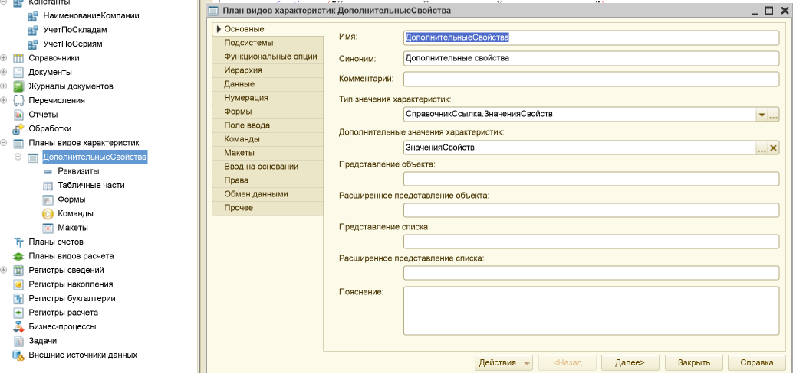

- [x] **ПВХ `ДополнительныеСвойства`: предопределённые элементы (`Материал`)**:  
  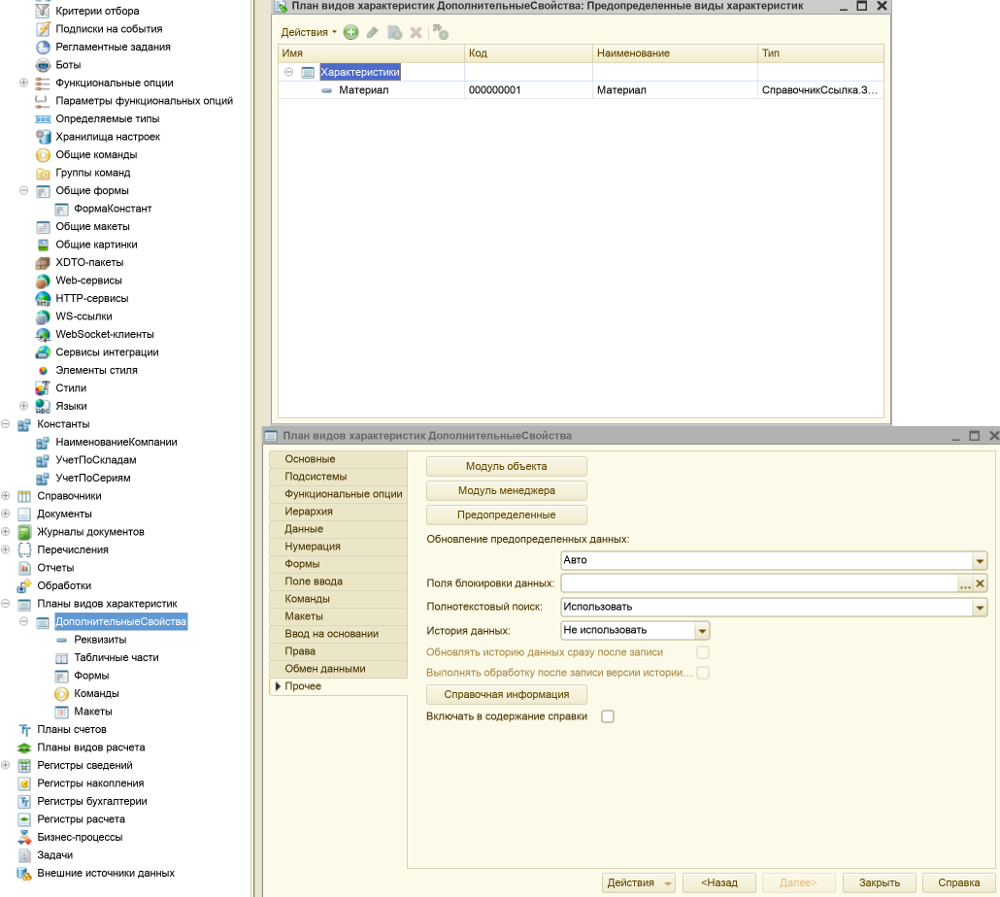

- [x] **Справочник `ЗначенияСвойств`: владелец = ПВХ `ДополнительныеСвойства`**:  
  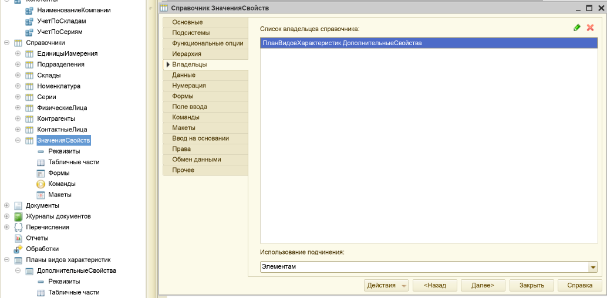

- [x] **Регистр сведений `СвойстваНоменклатуры`: измерения/ресурсы**:  
  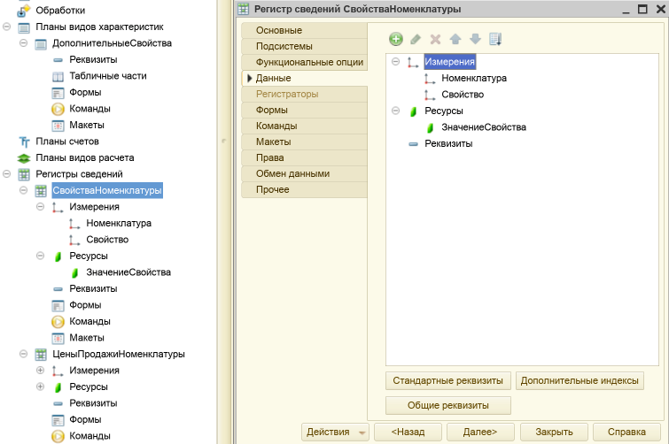

- [x] **Регистр сведений `ЦеныПродажиНоменклатуры`: периодичность/подчинение регистратору/ресурс Цена**:  
  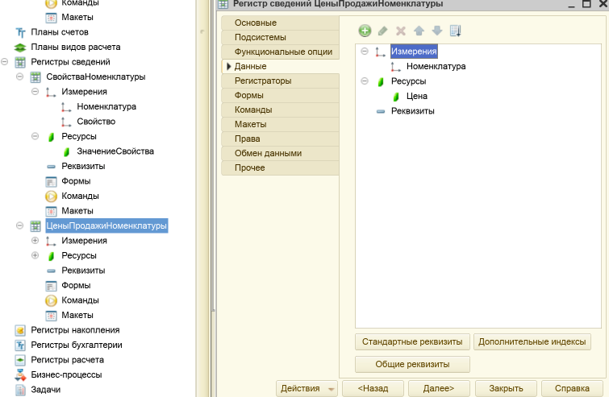

- [x] **Документ `УстановкаЦенНоменклатуры`: вкладка “Движения” (конструктор движений, заполненные выражения)**:  
  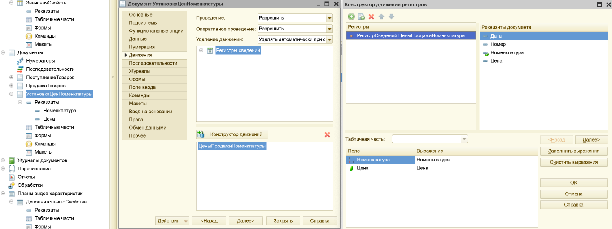

- [x] **`ПродажаТоваров`: модуль формы (функция `ПолучитьЦенуНоменклатуры` через `СрезПоследних` регистра)**:  
  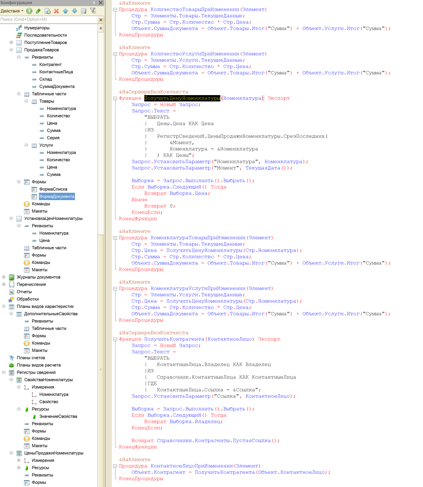

- [x] **Функциональная опция `УчетПоСкладам`: вкладка “Состав” (привязка к полю `Склад`)**:  
  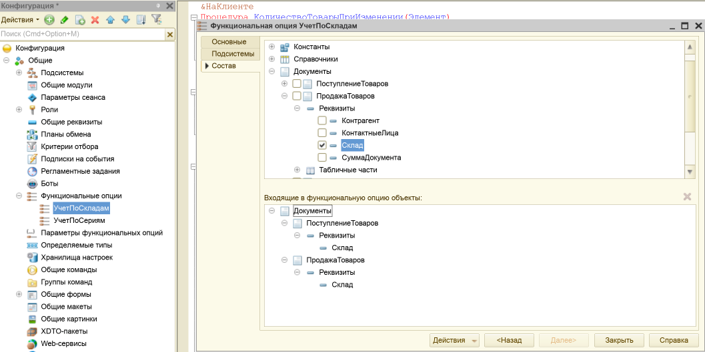

- [x] **Функциональная опция `УчетПоСериям`: вкладка “Состав” (привязка к полю/колонке `Серия`)**:  
  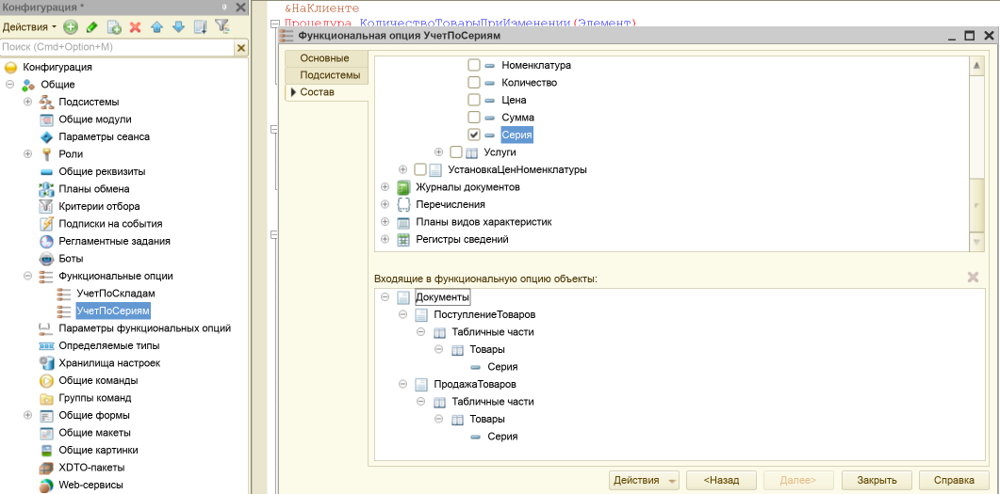

- [x] **Проверка опций (до): `УчетПоСериям=Истина`, в `ПродажаТоваров` колонка “Серия” видна**:  
  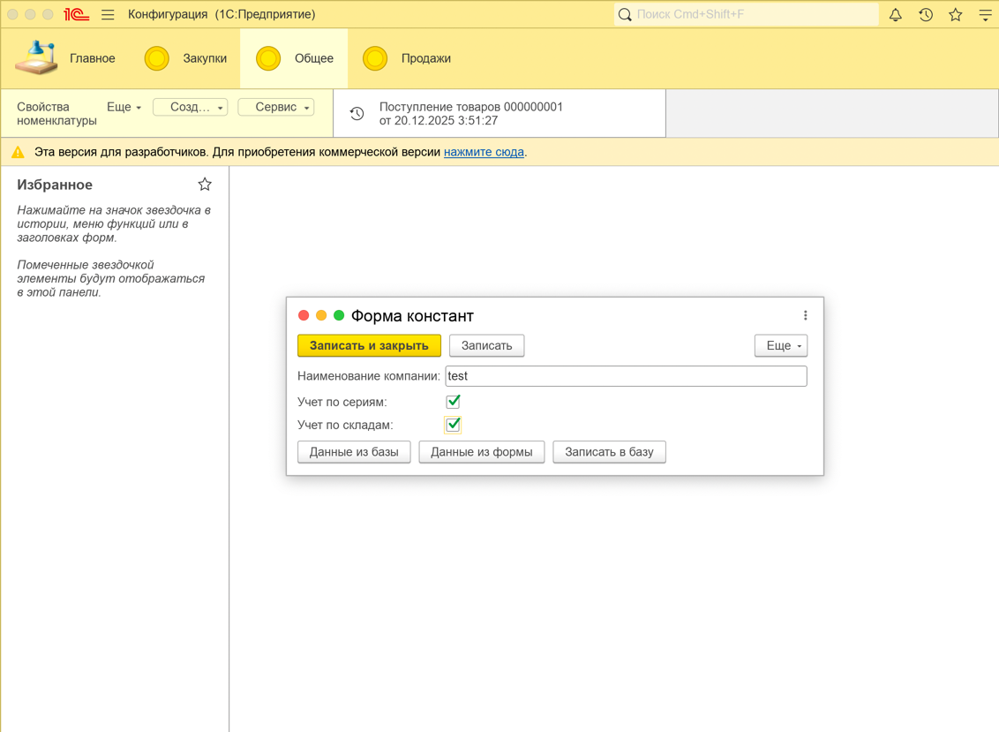
  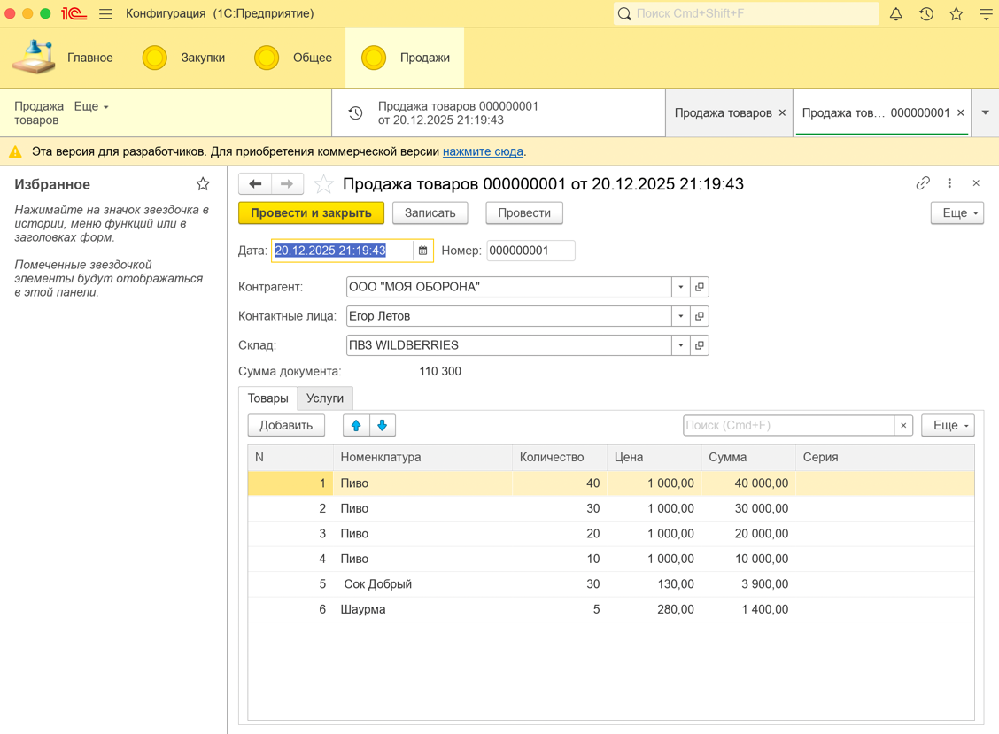

- [x] **Проверка опций (после): `УчетПоСериям=Ложь`, в `ПродажаТоваров` колонка “Серия” скрыта**:  
  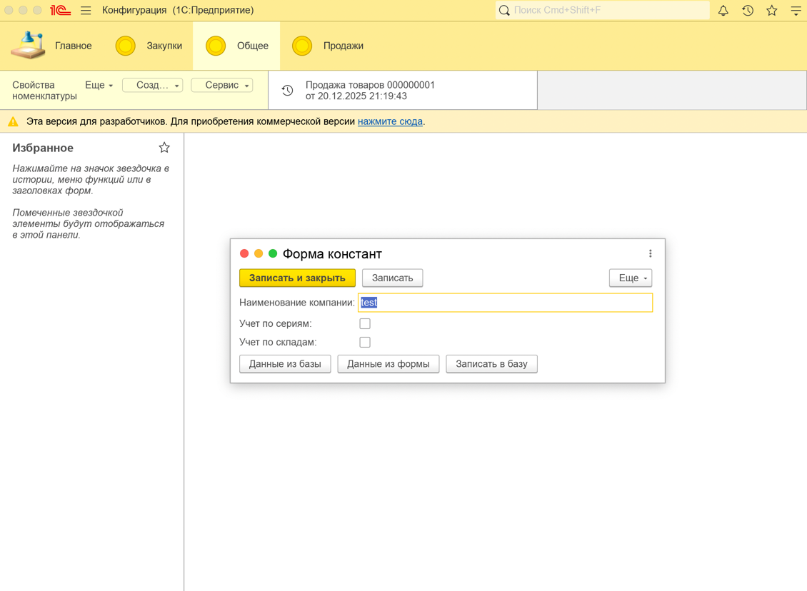
  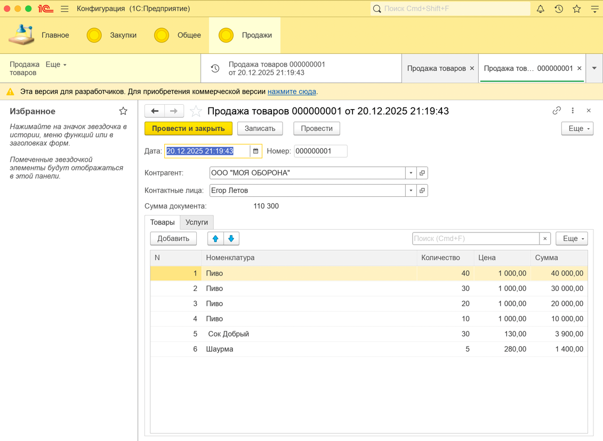

## Результат

В этой лабораторной работе я настроил механизм дополнительных свойств и цен в конфигурации.

Я создал ПВХ `ДополнительныеСвойства` и подчинённый ему справочник `ЗначенияСвойств`, добавил предопределённый элемент
`Материал`. Также я создал регистр сведений `СвойстваНоменклатуры`, чтобы хранить дополнительные свойства номенклатуры,
и регистр сведений `ЦеныПродажиНоменклатуры` (периодический, подчинённый регистратору) для хранения цен продажи.

Далее я реализовал документ `УстановкаЦенНоменклатуры`, который записывает цену в регистр `ЦеныПродажиНоменклатуры`, и
изменил получение цены в документе `ПродажаТоваров` так, чтобы цена подставлялась из регистра (через `СрезПоследних`).

В конце я настроил функциональные опции `УчетПоСкладам` и `УчетПоСериям` и проверил их работу: при изменении значений
опций в константах соответствующие поля/колонки (`Склад`, `Серия`) скрываются или отображаются в интерфейсе. Конфигурация
обновлена, работоспособность проверена в режиме «1С:Предприятие», база выгружена в `.dt`.

## Контрольные вопросы

1. **Для чего предназначены ПВХ?**

***Ответ:*** *ПВХ (План видов характеристик) я использую, когда нужно хранить “набор возможных характеристик” для
объектов, причём эти характеристики могут быть расширяемыми (пользователь/конфигурация добавляет новые). Это удобно для
дополнительных свойств номенклатуры, когда заранее не хочется жёстко фиксировать все поля.*

2. **С помощью каких форм можно представить пользователю данные ПВХ?**

***Ответ:*** *ПВХ можно показывать пользователю как обычный справочник: форма списка и форма элемента. Плюс часто
используются формы подчинённых справочников “значений” и формы, где эти свойства выбираются/заполняются в документах.*

3. **Каково назначение регистра сведений?**

***Ответ:*** *Регистр сведений предназначен для хранения “фактов/параметров” в разрезе измерений (например, цена по
номенклатуре, свойства по номенклатуре и т.д.). Я применяю его, когда нужно хранить значения, которые меняются во
времени или зависят от набора ключей.*

4. **Какие обязательные элементы входят в состав регистра сведений?**

***Ответ:*** *Минимально у регистра сведений есть измерения (ключи) и ресурсы/реквизиты (что хранится). Если регистр
периодический — ещё важна дата/период (временная привязка).*

5. **Что означает «периодичность»?**

***Ответ:*** *Периодичность задаёт, с какой точностью во времени хранятся и выбираются записи регистра (например, “в
пределах дня”). Я воспринимаю это как правило: сколько “срезов” в периоде может быть и как платформа будет выбирать
актуальную запись по времени.*

6. **Для чего необходимо подчинение регистратору и что может быть регистратором?**

***Ответ:*** *Подчинение регистратору нужно, чтобы записи регистра были “привязаны” к документу‑регистратору и
автоматически пересчитывались при перепроведении/отмене проведения. Регистратором обычно выступает документ (иногда
другие объекты, если это предусмотрено конфигурацией).*

7. **С помощью каких форм представляются данные регистра пользователю?**

***Ответ:*** *Данные регистра пользователю обычно показываются через форму списка/набор записей регистра, а ещё чаще —
через отчёты (в том числе СКД) и обработки, где эти данные анализируются.*

8. **Что такое «функциональные опции»?**

***Ответ:*** *Функциональные опции — это механизм “включить/выключить кусок функционала” (объекты, реквизиты, команды,
интерфейс) на уровне конфигурации/сеанса. Я использую их, чтобы скрывать/отключать части системы без удаления
метаданных, например включаемость учёта по складам/сериям.*
