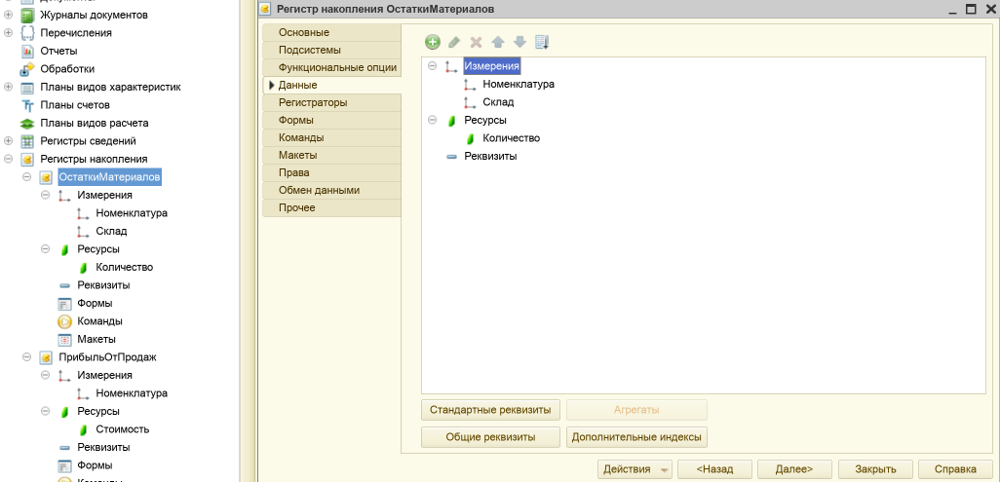
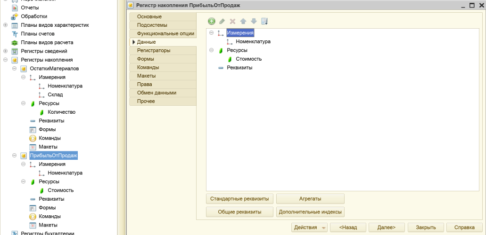
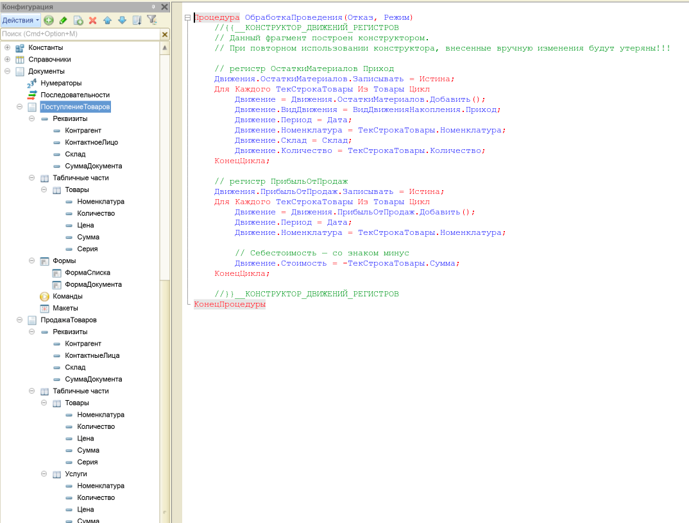
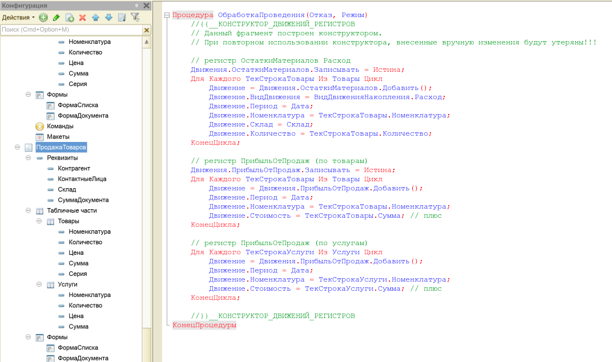
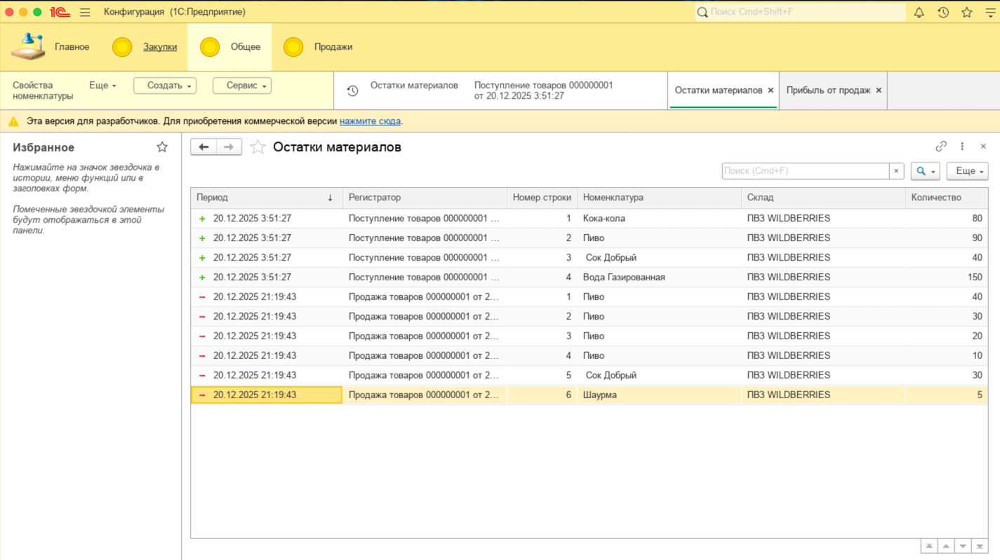
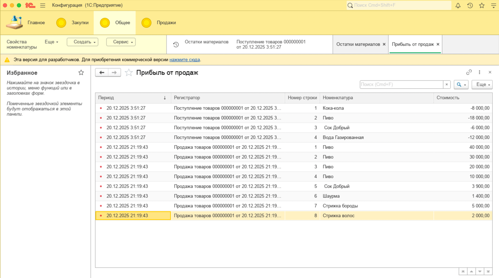

# Лабораторная работа №5 — Регистры накопления. Обработка проведения документа

## Цель

Цель работы – ознакомиться с основными характеристиками регистров накопления «1С:Предприятие 8.2», получить практические
навыки работы с данными объектами платформы.

## Среда выполнения

- **ОС**: macOS
- **Платформа 1С**: (8.3.27)
- **Тип ИБ**: файловая

## Порядок выполнения (чеклист)

1.  [x] *Создать регистр накопления `ОстаткиМатериалов` (вид: Остатки), подсистема `Общее`;
    измерения `Номенклатура`, `Склад`; ресурс `Количество` (10:0).*

2.  [x] *Создать регистр накопления `ПрибыльОтПродаж` (вид: Обороты), подсистема `Общее`; измерение `Номенклатура`;
    ресурс `Стоимость` (15:2).*

3.  [x] *У обоих регистров указать регистраторы: документы `ПродажаТоваров` и `ПоступлениеТоваров`.*

4.  [x] *В документе `ПоступлениеТоваров` запустить конструктор движений для `ОстаткиМатериалов`.*

5.  [x] *Тип движения: Приход; заполнить выражения (реквизиты документа/табличной части).*

6.  [x] *Добавить движения по `ПрибыльОтПродаж` (аналогично), заполнить выражения, ОК.*

7.  [x] *Изменить обработчик проведения по методичке (код как на рисунке).*

8.  [x] *Аналогично выполнить настройку проведения для документа `ПродажаТоваров` (код как в методичке).*

9.  [x] *Обновить функциональные опции под новую конфигурацию (если требуется методичкой).*

10. [x] *Выполнить компиляцию, перепровести существующие документы, проверить движения/остатки/обороты.*

## Артефакты

- [x] **Регистр `ОстаткиМатериалов` (вид “Остатки”, измерения `Номенклатура`/`Склад`, ресурс `Количество`)**:  
  

- [x] **Регистр `ПрибыльОтПродаж` (вид “Обороты”, измерение `Номенклатура`, ресурс `Стоимость`)**:  
  

- [x] **Код проведения (обработчик `ОбработкаПроведения`)**:  
  
  

- [x] **Проверка регистров в “1С:Предприятие” (`ОстаткиМатериалов` и `ПрибыльОтПродаж`)**:  
  
  

## Результат

В этой лабораторной работе я настроил учет остатков и оборотов с помощью регистров накопления.

Я создал регистр накопления `ОстаткиМатериалов` (вид “Остатки”) с измерениями `Номенклатура` и `Склад` и ресурсом
`Количество`, а также регистр накопления `ПрибыльОтПродаж` (вид “Обороты”) с измерением `Номенклатура` и ресурсом
`Стоимость`. Для обоих регистров я указал регистраторы `ПоступлениеТоваров` и `ПродажаТоваров` и настроил движения
документов через конструктор движений и обработчик проведения.

После этого я обновил конфигурацию базы данных, перепровёл документы и проверил результаты: в регистре
`ОстаткиМатериалов` появились движения прихода/расхода по складам и номенклатуре, а в регистре `ПрибыльОтПродаж`
отразились обороты по стоимости. Работоспособность проверена в режиме «1С:Предприятие».

## Контрольные вопросы

1. **Для чего предназначен регистр накоплений?**

***Ответ:*** *Регистр накопления предназначен для учета количественных/суммовых показателей во времени: остатки и/или
обороты. Я использую его, когда нужно хранить “движения” (приход/расход) и получать остатки или обороты по измерениям (
например, по складу и номенклатуре).*

2. **Чем регистр накоплений отличается от регистра сведений?**

***Ответ:*** *Регистр сведений — это хранение фактов/параметров (обычно без “приход/расход”), а регистр накопления — это
именно учет движения ресурсов (приход/расход) с расчетом остатков или оборотов. У накопления есть вид (Остатки/Обороты)
и логика движения, что делает его “учётным” регистром.*

3. **Что является основными элементами регистра накоплений?**

***Ответ:*** *Основные элементы — это **измерения** (разрезы учета), **ресурсы** (что накапливаем: количество, сумма и
т.д.), а также признак движения (приход/расход) и, при необходимости, реквизиты для доп. информации.*

4. **Что является регистратором?**

***Ответ:*** *Регистратор — это объект, который “записывает движения” в регистр (чаще всего документ). Я настроил
документы так, чтобы при проведении они формировали движения в нужных регистрах.*

5. **Для чего нужен конструктор движения? Что является результатом его работы?**

***Ответ:*** *Конструктор движений нужен, чтобы быстро сформировать шаблон записи движений по табличной части/реквизитам
документа. Результат его работы — автоматически созданный код (в обработчике проведения) и заполненная структура
движений, которую потом можно доработать вручную.*
