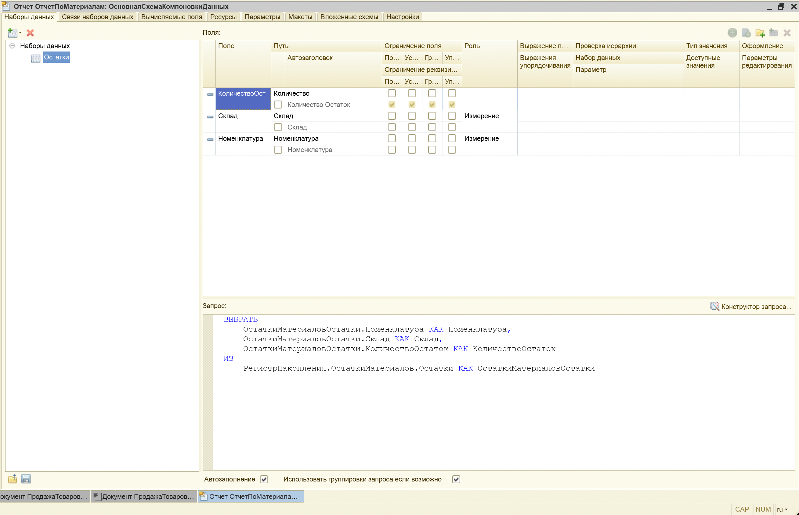
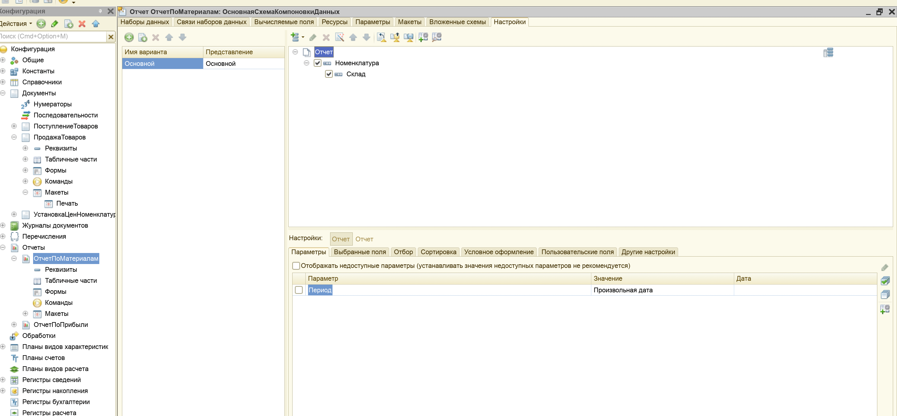
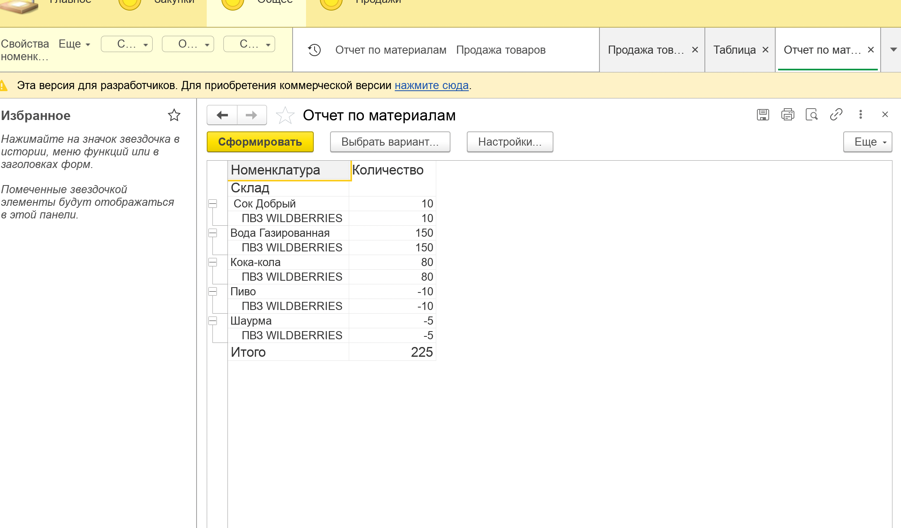
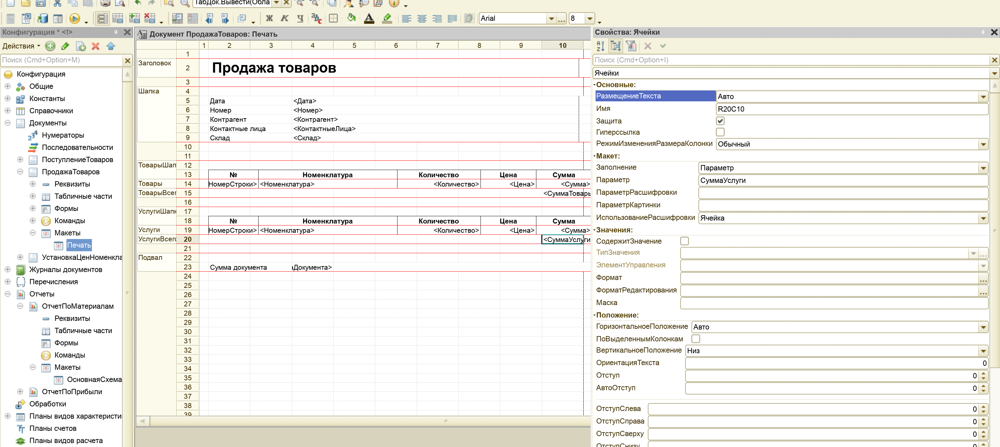
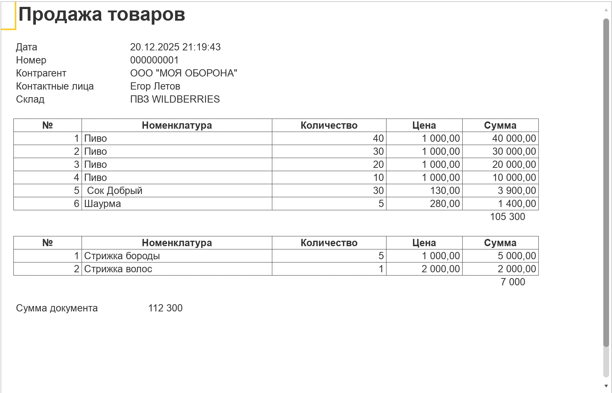

# Лабораторная работа №6 — Отчеты. Макеты печати

## Цель

Цель работы – изучить возможности платформы «1С:Предприятие 8.2» по созданию отчетов и макетов для печати документов и
получить практические навыки работы с данными объектами платформы.

## Среда выполнения

- **ОС**: macOS
- **Платформа 1С**: (8.3.27)
- **Тип ИБ**: файловая

## Порядок выполнения (чеклист)

1.  [x] *Создать отчет `ОтчётПоМатериалам`, отнести к `Общее`.*

2.  [x] *Открыть схему компоновки данных (СКД) → «Готово».*

3.  [x] *Добавить набор данных `Остатки` (тип: запрос).*

4.  [x] *В конструкторе запроса собрать запрос как в методичке.*

5.  [x] *Проверить, что набор данных сформирован корректно (как на рисунке).*

6.  [x] *Переименовать путь поля `КоличестваОстаток` на `Количество`.*

7.  [x] *Вкладка «Настройки»: добавить группировку (по умолчанию).*

8.  [x] *В «Выбранных полях» указать: `Номенклатура`, `Склад`, `Количество`.*

9.  [x] *В «Ресурсах» указать ресурс: `Количество`.*

10. [x] *В «ДетальныхЗаписях» указать `Номенклатура`; добавить группировку по `Склад`.*

11. [x] *Скомпилировать и проверить отчёт.*

12. [x] *Аналогично создать отчёт по прибыли от продаж (по методичке).*

13. [x] *Открыть документ `ПродажаТоваров` → вкладка «Макеты» → конструктор печати.*

14. [x] *В конструкторе печати: создать новую команду; распределить реквизиты (шапка/табличные части/подвал) как в методичке.*

15. [x] *В макете: раздвинуть область `УслугиШапка`; назначить имя области `ТоварыВсего` после `Товары`.*

16. [x] *Аналогично добавить область `УслугиВсего` после `Услуги`.*

17. [x] *Обновить конфигурацию БД, проверить формирование отчётов и печать.*

18. [x] *Выгрузить `.dt` (если требуют).*

## Артефакты

- [x] **СКД набора данных/запрос**:  
  

- [x] **Настройки СКД (поля/группировки/ресурсы)**:  
  

- [x] **Результат отчёта**:  
  

- [x] **Конструктор печати + макет с областями**:  
  

- [x] **Печать документа в режиме «1С:Предприятие»**:  
  

## Результат

Кратко: отчёты формируются, печатная форма выводится.

## Контрольные вопросы

1. **Для чего предназначены отчеты?**

***Ответ:*** *Отчёты предназначены для анализа данных системы и получения итоговой информации в удобном виде. Я
использую отчёты, чтобы быстро увидеть остатки, обороты, прибыль и другие показатели, не “копаясь” руками в документах и
регистрах.*

2. **Что позволяет сделать схема компоновки данных?**

***Ответ:*** *СКД позволяет описать структуру отчёта: источник данных (запрос/таблицы), поля, группировки, отборы,
сортировки, ресурсы и представления. По сути, это конструктор, который сильно ускоряет создание отчётов без большого
объёма кода.*

3. **Для чего нужен конструктор запроса?**

***Ответ:*** *Конструктор запроса помогает собрать запрос визуально (выбрать таблицы, связи, поля, условия), и он
автоматически формирует текст запроса. Я использую его, чтобы меньше ошибаться в синтаксисе и быстрее получить нужный
набор данных.*

4. **С помощью чего можно создать макет печатной формы?**

***Ответ:*** *Макет печатной формы создаётся через объект `Макет` (обычно табличный документ) и конструктор печати в
документе/отчёте. Дальше макет заполняется данными программно и выводится на печать/в предпросмотр.*
