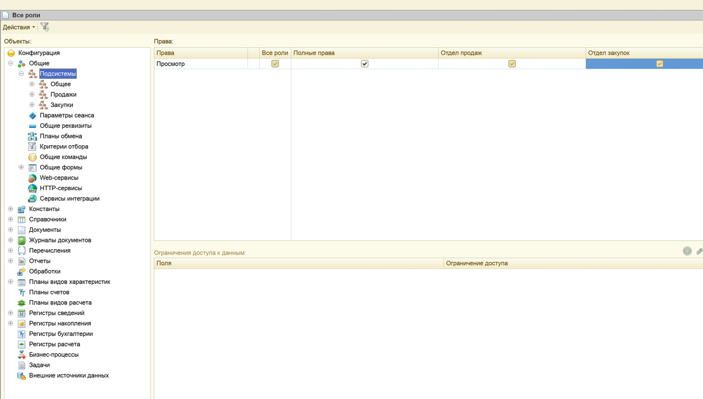
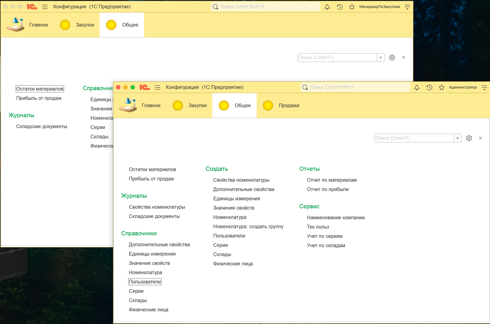
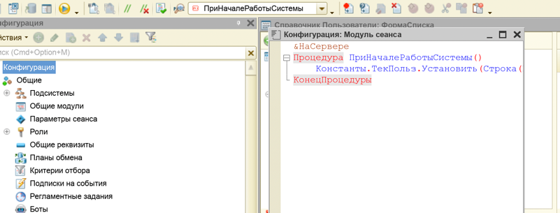
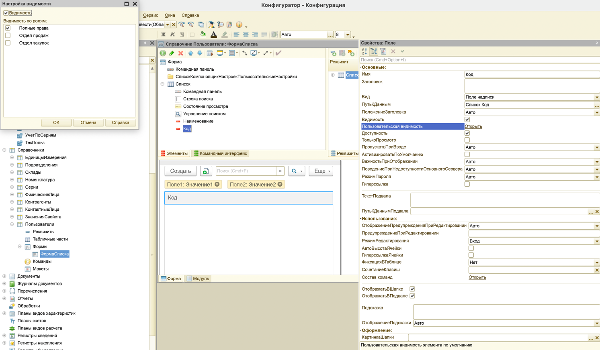

# Лабораторная работа №7 — Пользователи. Права и роли

## Цель

Цель работы – изучить возможности платформы «1С:Предприятие 8.2» по настройке ролей пользователей и получить
практические навыки работы с данными объектами платформы.

## Среда выполнения

- **ОС**: macOS
- **Платформа 1С**: (8.3.27)
- **Тип ИБ**: файловая

## Порядок выполнения (чеклист)

1.  [x] *В режиме «1С:Предприятие» (Администрирование → Пользователи) создать 3
    пользователей: `Администратор`, `МенеджерПоПродажам`, `МенеджерПоЗакупкам`.*

2.  [x] *Назначить им соответствующие права.*

3.  [x] *Создать справочник `Пользователи`, отнести к `Общее → Справочники`.*

4.  [x] *Запустить «1С:Предприятие», заполнить справочник `Пользователи` значениями (3 записи).*

5.  [x] *Создать константу `ТекПольз` (Строка 50).*

6.  [x] *В модуле сеанса конфигурации создать процедуру для заполнения `ТекПольз` при начале сеанса (как в методичке).*

7.  [x] *Создать форму списка для справочника `Пользователи`.*

8.  [x] *Для реквизита списка включить «Динамический список» и настроить произвольный запрос через конструктор (по
    методичке).*

9.  [x] *Для реквизита `Код` установить пользовательскую видимость только для полных прав.*

10. [x] *Для ролей `ОтделПродаж` и `ОтделЗакупок` настроить права (с учётом связанных объектов).*

11. [x] *Запустить режим отладки и проверить работоспособность.*

## Артефакты

- [x] **Пользователи (администрирование)**:  
  

- [x] **Роли/права**:  
  
  

- [x] **Константа `ТекПольз` + модуль сеанса**:  
  

- [x] **Форма списка (динамический список/запрос)**:  
  

## Вставленный код (из методички)

```bsl
&НаСервере
Процедура ПриНачалеРаботыСистемы()
    Константы.ТекПольз.Установить(Строка(ПользователиИнформационнойБазы.ТекущийПользователь()));
КонецПроцедуры
```

## Результат

Кратко: пользователи/роли настроены, видимость полей и доступы проверены.

## Контрольные вопросы

1. **Что такое «роль» и что такое «права» пользователя?**

***Ответ:*** *Роль — это “набор разрешений”, который я назначаю пользователю. Права — это конкретные разрешения на
объекты и действия (чтение, добавление, изменение, удаление, проведение и т.д.). То есть роль объединяет права, чтобы
было проще управлять доступом.*

2. **С помощью какого механизма можно скрыть некоторые поля формы объекта?**

***Ответ:*** *Я могу скрывать поля через **область видимости** и **пользовательскую видимость** (в свойствах элементов
формы) в зависимости от роли/прав. Плюс можно использовать функциональные опции, если нужно включать/выключать часть
интерфейса как функционал.*

3. **К какой категории объектов относится объект «Роль»?**

***Ответ:*** *«Роль» относится к объектам конфигурации, которые отвечают за администрирование и безопасность (
разграничение доступа). Это не прикладной объект “данных”, а объект настройки прав.*

4. **В каких случаях необходимо выполнять настройку ролей?**

***Ответ:*** *Настройка ролей нужна всегда, когда в системе есть разные типы пользователей и нужно ограничить доступ к
данным/командам: например, менеджер продаж видит “своё”, закупщик — “своё”, а администратор — всё. Без ролей нельзя
нормально обеспечить безопасность и разделение обязанностей.*
