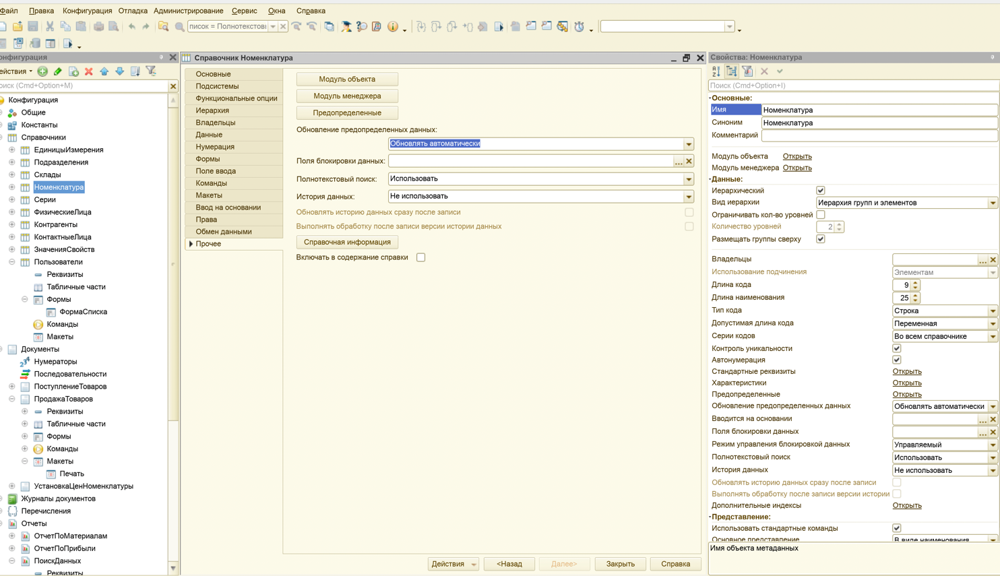
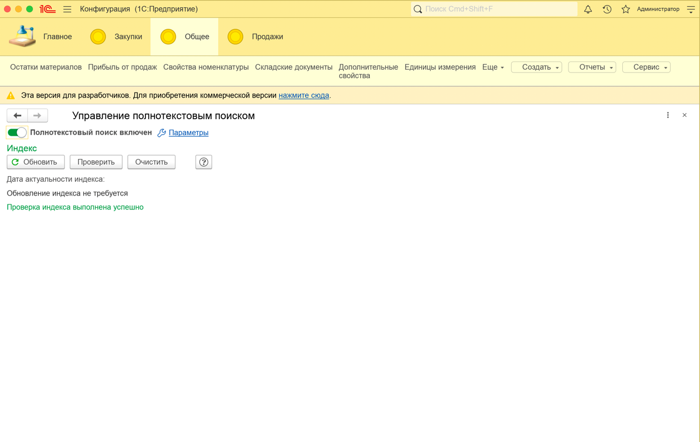
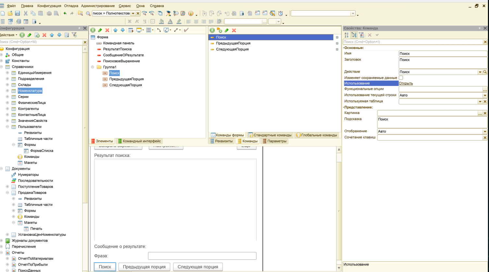
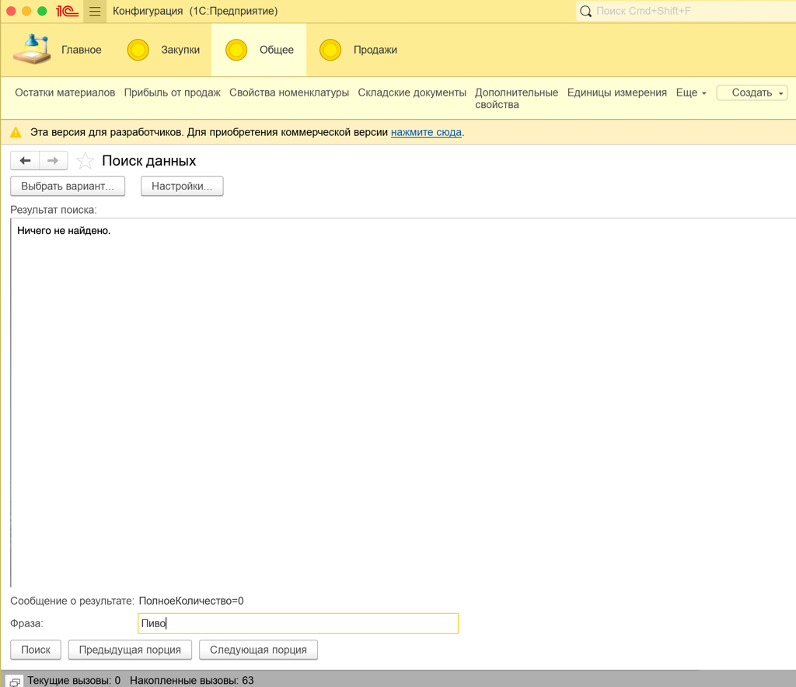

# Лабораторная работа №8 — Полнотекстовый поиск

## Цель

Цель работы – изучить возможности платформы «1С:Предприятие 8.2» по настройке полнотекстового поиска и получить
практические навыки работы с настройками индексирования.

## Среда выполнения

- **ОС**: macOS
- **Платформа 1С**: (8.3.27)
- **Тип ИБ**: файловая

## Порядок выполнения (чеклист)

1.  [x] *Открыть конфигуратор и проверить, что для всех объектов и их реквизитов режим полнотекстового поиска установлен
    как «Использовать»*

2.  [x] *Открыть режим отладки. Перейти: «Все функции» → «Стандартные» → «Управление полнотекстовым поиском».*

3.  [x] *Включить полнотекстовый поиск (Настройка… → флаг включения), если выключен.*

4.  [x] *Обновить индекс и проверить дату актуальности индекса.*

5.  [x] *Создать отчёт `ПоискДанных`, отнести к `Общее`, создать основную форму.*

6.  [x] *Создать реквизит формы `ПоисковоеВыражение` (заголовок «Фраза»), добавить на форму.*

7.  [x] *Создать команду `Поиск`, назначить обработчик (пока пустой), вынести на форму; для кнопки включить «Кнопка по
    умолчанию».*

8.  [x] *Создать реквизит `СообщениеОРезультате`; элемент формы: «Поле надписи», заголовок — «Нет».*

9.  [x] *Создать реквизит `РезультатПоиска`; элемент формы: «Поле HTML документа», заголовок — «Нет».*

10. [x] *Создать команды `ПредыдущаяПорция` и `СледующаяПорция`, объявить обработчики.*

11. [x] *Создать реквизиты: `РезультатыПоиска` (СписокЗначений) и `ТекущаяПозиция` (Число) — можно не добавлять на
    форму.*

12. [x] *Для созданных команд задать код обработчиков (по методичке).*

13. [x] *Создать процедуру `Искать` (клиентская) — запуск серверной обработки + проверка ввода (по методичке).*

14. [x] *Создать процедуру `ИскатьСервер` — получение результатов поиска (по методичке).*

15. [x] *Создать обработчик нажатия для `РезультатПоиска` (по методичке).*

16. [x] *Обновить конфигурацию БД, проверить поиск в режиме «1С:Предприятие».*

## Артефакты

- [x] **Настройки полнотекстового поиска по объектам**:  
  

- [x] **Управление полнотекстовым поиском (индекс/дата)**:  
  

- [x] **Форма отчёта `ПоискДанных`**:  
  

- [x] **Результаты поиска (HTML)**:  
  

## Код модуля поиска

```bsl
&НаКлиенте
Процедура Поиск(Команда)
    Искать();
КонецПроцедуры

&НаКлиенте
Процедура ПредыдущаяПорция(Команда)
	Если ТекущаяПозиция <= 1 Тогда Возврат; КонецЕсли;
	ТекущаяПозиция = ТекущаяПозиция - 1;
	ПолучитьИПоказатьПорцию();
КонецПроцедуры

&НаКлиенте
Процедура СледующаяПорция(Команда)
	ТекущаяПозиция = ТекущаяПозиция + 1;
	ПолучитьИПоказатьПорцию();
КонецПроцедуры

&НаКлиенте
Функция РазмерПорции() Экспорт
    Возврат 10;
КонецФункции

&НаКлиенте
Процедура Искать()
    ТекущаяПозиция = 1;
    ПолучитьИПоказатьПорцию();
КонецПроцедуры

&НаКлиенте
Процедура ПолучитьИПоказатьПорцию()
    Попытка
	    Данные = ИскатьСервер(ПоисковоеВыражение, ТекущаяПозиция, РазмерПорции());
	Исключение
	    СообщениеОРезультате = "Ошибка поиска: " + ОписаниеОшибки();
	    Сообщить(ОписаниеОшибки());
	    Возврат;
	КонецПопытки;

    РезультатыПоиска = Данные.Результаты;
    СообщениеОРезультате = Данные.Сообщение;

    ОбновитьВывод();
КонецПроцедуры
	
&НаСервереБезКонтекста
Функция ИскатьСервер(Фраза, НомерЧасти, РазмерПорции) Экспорт
    Список = ПолнотекстовыйПоиск.СоздатьСписок();
	
	Список.ОграничиватьСтрокуПоиска = Ложь;
	Список.ПорогНечеткости = 0;
	
	Список.ИспользованиеМетаданных = ИспользованиеМетаданныхПолнотекстовогоПоиска.Использовать;
	Список.ОбластьПоиска.Очистить();
	Список.ОбластьПоиска.Добавить(Метаданные.Справочники.Номенклатура);
	
    Список.СтрокаПоиска = Фраза;
    Список.РазмерПорции = РазмерПорции;
    Список.ПолучатьПредставление = Истина;

    // Если ничего нет — сразу пусто
    Если Список.Количество() = 0 Тогда
        Возврат Новый Структура("Результаты,Сообщение",
            Новый СписокЗначений, "Найдено: 0");
    КонецЕсли;

    // Перейдём к нужной части (1 = первая)
    Если НомерЧасти < 1 Тогда
        НомерЧасти = 1;
    КонецЕсли;

    Список.ПерваяЧасть();
    Для i = 2 По НомерЧасти Цикл
        Список.СледующаяЧасть();
	КонецЦикла;
	
	Возврат Новый Структура(
	    "Результаты,Сообщение",
	    Новый СписокЗначений,
	    "ПолноеКоличество=" + Строка(Список.ПолноеКоличество)
	);

    Таблица = Список.Получить();

    Результаты = Новый СписокЗначений;

    ИмяКолонкиСсылка = "";
    Если Таблица.Колонки.Найти("Ссылка") <> Неопределено Тогда
        ИмяКолонкиСсылка = "Ссылка";
    ИначеЕсли Таблица.Колонки.Найти("Объект") <> Неопределено Тогда
        ИмяКолонкиСсылка = "Объект";
    ИначеЕсли Таблица.Колонки.Найти("Значение") <> Неопределено Тогда
        ИмяКолонкиСсылка = "Значение";
    КонецЕсли;

    Для Каждого Стр Из Таблица Цикл
        Если ПустаяСтрока(ИмяКолонкиСсылка) Тогда Продолжить; КонецЕсли;

        СсылкаОбъекта = Стр[ИмяКолонкиСсылка];
        Если СсылкаОбъекта = Неопределено Тогда Продолжить; КонецЕсли;

        Текст = ?(Таблица.Колонки.Найти("Представление") <> Неопределено,
                 Стр.Представление, Строка(СсылкаОбъекта));

        Результаты.Добавить(ПолучитьНавигационнуюСсылку(СсылкаОбъекта), Текст);
    КонецЦикла;

    Возврат Новый Структура("Результаты,Сообщение",
        Результаты, "Найдено: " + Строка(Список.Количество()));
КонецФункци	

&НаКлиенте
Процедура ОбновитьВывод()
    Html = "<html><body style='font-family:sans-serif;font-size:13px;'>";

    Если РезультатыПоиска = Неопределено Или РезультатыПоиска.Количество() = 0 Тогда
        Html = Html + "<div>Ничего не найдено.</div>";
    Иначе
        Для i = 0 По РезультатыПоиска.Количество() - 1 Цикл
            ЭлементСписка = РезультатыПоиска.Получить(i);
            НавСсылка = Строка(ЭлементСписка.Значение);
            ТекстСтроки = ЭлементСписка.Представление;

            Html = Html + "<div style='margin:6px 0;'>";
            Html = Html + "<a href='" + НавСсылка + "'>" + ТекстСтроки + "</a>";
            Html = Html + "</div>";
        КонецЦикла;
    КонецЕсли;

    Html = Html + "</body></html>";
    РезультатПоиска = Html;
КонецПроцедуры

&НаКлиенте
Процедура РезультатПоискаПриНажатии(Элемент, Гиперссылка, СтандартнаяОбработка)
    СтандартнаяОбработка = Ложь;
    Если НЕ ПустаяСтрока(Гиперссылка) Тогда
        ПерейтиПоНавигационнойСсылке(Гиперссылка);
    КонецЕсли;
КонецПроцедуры
```

## Результат

Я включил полнотекстовый поиск для объектов/реквизитов, обновил индекс 
и проверил поиск по тестовой записи. Для диагностики вывел ПолноеКоличество 
у списка полнотекстового поиска — оно равно 0, то есть полнотекстовый индекс пустой. 
Поэтому результаты поиска не отображаются. Повторное обновление индекса результата не дало.

## Контрольные вопросы

1. **Каков механизм реализации полнотекстового поиска?**

***Ответ:*** *Механизм такой: платформа строит полнотекстовый индекс по выбранным объектам/реквизитам, а затем поиск
выполняется по этому индексу (а не “в лоб” по таблицам). Я сначала включаю индексирование, обновляю индекс, и потом уже
выполняю запросы полнотекстового поиска.*

2. **Как задается запрос на полнотекстовый поиск?**

***Ответ:*** *Запрос задаётся строкой поискового выражения (фразой), которую платформа интерпретирует при выполнении
поиска. В конфигурации это можно делать программно (встроенным языком) или через интерфейс, а дальше результаты
возвращаются как список найденных объектов/фрагментов.*

3. **Возможно ли использования логических операций при полнотекстовом поиске?**

***Ответ:*** *Да, можно использовать логические операции (типа И/ИЛИ/НЕ и похожие конструкции) — это одно из преимуществ
полнотекстового поиска, он похож на “поиск как в интернете”.*

4. **Для чего необходим полнотекстовый индекс?**

***Ответ:*** *Полнотекстовый индекс нужен, чтобы поиск был быстрым и масштабируемым. Без индекса поиск по большому
объёму текстов был бы очень медленным, потому что пришлось бы каждый раз просматривать множество записей напрямую.*

5. **Необходимо ли обновлять полнотекстовый индекс?**

***Ответ:*** *Да, индекс нужно обновлять, иначе поиск будет “видеть” неактуальные данные. Обычно индекс обновляется по
расписанию/при необходимости, а в лабораторной работе я обновляю его вручную через управление полнотекстовым поиском.*
